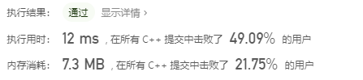

# 一、 leetcode基础算法
## 1.1 删除排序数组中的重复项
### （1）问题描述
&emsp;（i）**有序**数组
&emsp;（ii）**原地**删除重复出现的元素，并返回新数组的长度

### （2）参考代码
```C++
class Solution {
public:
    int removeDuplicates(vector<int>& nums) {
        // 若不为空，则从1开始，即num值至少为1
        if (nums.size() == 0)
            return 0;

        int pre = nums[0];
        int num = 1;
        for (int i = 1; i < nums.size(); ++i) {
            // 异或，判断是否相等，相等，不做处理；否则缓存当前值并改变数组
            if (pre ^ nums[i]) {    
                pre = nums[i];
                nums[num++] = nums[i];
            }
        }
        return num;
    }
};
```

### （3）简要描述
&emsp;（i）数组中**要么为空，要么元素数量(num)>=1**，因此循环从1开始即可
&emsp;（ii）如果元素不相等，那么异或值为1


### （4）更进一步
其实本题和STL中<font color=#ff0000> std::unique() </font>功能是一致的。
功能：<font color=#ff0000> "删除"</font>容器中重复的元素。所谓的删除其实是把重复的元素后移，并没有真正的删除。要真正的删除必须使用<font color=#ff0000> erase </font>。
```C++
  template<typename _ForwardIterator>
    inline _ForwardIterator
    unique(_ForwardIterator __first, _ForwardIterator __last)
```

参考代码
```C++
class Solution {
public:
    int removeDuplicates(vector<int>& nums) {
      auto pos = std::unique(nums.begin(), nums.end());
        return pos - nums.begin();
        }
};
```


<font color=#ff0000> 注意 </font>
&emsp;（i）从结果看，虽然STL的算法库函数很方便，但是其性能确实不是最好，当然仅本题目
&emsp;（ii）<font color=#ff0000> std::unique() </font>只适合顺序影像，对于链表而言性能很差，应当使用其成员函数。

<br/>

## 1.2 买卖股票的最佳时机II
### （1）问题描述
&emsp;（i）一个数组，第i个元素是股票第i天的价格
&emsp;（ii）反复购买，使得利润最大

### （2）参考代码
```C++
class Solution {
public:
    int maxProfit(vector<int>& prices) {
        if (prices.size() <= 1) // 当数组最多一个元素，则不需要购买，利润为0
            return 0;

        int maxMoney = 0, Profit = 0;
        for (int i = 1; i < prices.size(); i++) {
            // 寻找上升段，当然最极端的上升沿是只有两个数
            if ((Profit = prices[i] - prices[i - 1]) > 0)
                maxMoney += Profit;
        }
        return maxMoney;
    }
};
```


### （3）简要描述
&emsp;（i）当数组最多一个元素，则不需要购买（一买就亏），利润为0
&emsp;（ii）为了使得利润最大，只需要考虑上升段。然而上升段都是一段一段拼接而成的，只需要考虑最小的上升段，即<font color=#ff0000> (Profit = prices[i] - prices[i - 1]) > 0 </font>

<font color=#ff0000> 注意 </font>
&emsp;（i）由于题目的输入限制，求和变量最大值是$3*10^8$,所以直接使用int即可
&emsp;（ii）int在32位机器或者64位机器，都是4B，即-2147483648 ~ 2147483647，10位数！

<font color=#ff0000> 贪心 </font>
这个代码背后就是贪心的思想，贪的是什么？<font color=#ff0000>0和收益，如果收益为正取收益，收益为负取0</font>
```C++
// 本质和上面的代码是一致的，要么贪0，要么贪正收益
maxMoney += max(0, prices[i] - prices[i - 1]);
```

### （4）更进一步
&emsp;这个题目可以用动态规划来解决。
<font color=#ff0000>动态规划</font>：可以理解成状态转移。完成某件事有很多种方式，**根据题目要求**选择最大、最小的那种。比如这里就有两种选择方式，目标是利润最大化。

```C++
class Solution {
public:
    int maxProfit(vector<int>& prices) {
        int n = prices.size();
        int dp[n][2]; // [][0]:手中没有股票时（最大利润）; [][1]:手中有股票时（最大利润）

        // 边界条件，之后从1开始
        dp[0][0] = 0;          //第零天手中没有股票，利润为0
        dp[0][1] = -prices[0]; //第零天手中有股票，亏了

        for (size_t i = 1; i < n; ++i) {
            //手中没有股票的结果=前一天就没有+前一天有后卖了（买股票收益）
            dp[i][0] = std::max(dp[i - 1][0], dp[i - 1][1] + prices[i]); 
            //手中有股票的结果=前一天就有+前一天没有后买了（卖股票亏损）
            dp[i][1] = std::max(dp[i - 1][1], dp[i - 1][0] - prices[i]); 
        }
        return dp[n - 1][0]; // 返回[n-1][0]
    }
};
```


**简要描述**
&emsp;（i）动态规划有三要素：<font color=#ff0000>定义状态矩阵；边界条件；状态转移；</font>
&emsp;（ii）<font color=#ff0000>定义状态矩阵:</font> 由于对具体的一个状态，要么手中没有股票([][0]),要么手中有股票([][1])，一共有n天。即dp[n][2]
&emsp;（iii）<font color=#ff0000>边界条件:</font> 显然第一天手中没有股票(dp[0][0]=0),有股票就是买了第一天的，亏损(dp[0][1])
&emsp;（iv）<font color=#ff0000>状态转移:</font> 
&emsp;&emsp; 手中没有股票的结果=前一天就没有+前一天有后卖了（买股票收益）;
&emsp;&emsp; 手中有股票的结果=前一天就有+前一天没有后买了（卖股票亏损）

<br/>

## 1.3 旋转数组
### （1）问题描述
&emsp;（i）将数组中的元素向右移动k个位置，k>=0

### （2）参考代码
```C++
void rotate(vector<int> &nums, int k)
{
    k %= nums.size();   //其有效值只有0到nums.size()-1

    std::reverse(nums.begin(), nums.end());       //整个数组逆序
    std::reverse(nums.begin(), nums.begin() + k); //前K个逆序
    std::reverse(nums.begin() + k, nums.end());   //后面所有逆序
}
```


### （3）简要描述
&emsp;（i）第一步进行取模降低重复的移动次数
&emsp;（ii）这题的思想有些像<font color=#ff0000>分治，即先分后合，分而治之。</font>但是并不是真正的分治，因为这里是先合后分。数逆序，汉诺塔等是典型的分治问题。
&emsp;（iii）仅需要两步即可，<font color=#ff0000>先对整个数组逆序，再分别各自逆序即可。</font>如下图

&emsp;（iv）对于C++而言，算法库<font color=#ff0000>std::reverse()</font>表示对容器逆序，迭代器都是<font color=#0000ff>左开右闭</font>。因此代码中两处都是+k

### （4）更进一步
&emsp;（i）下面就对数组逆序做一些改进。最简单的思路就是设置<font color=#ff0000>首尾计数标记，当两个标记相遇，此时就完成了数组逆序</font>
&emsp;（ii）交换连个元素，这里使用了-异或的方式，不需要多定义一个临时变量。

```C++
class Solution {
public:
    void swap(int *a, int *b) {
        *a ^= *b;
        *b ^= *a;
        *a ^= *b;
    }
    void rotate(vector<int>& nums, int k) {
        int n = nums.size();
        k %= n;
        // 注意：下面涉及k-1，则k决不能为0,也就是取模下来不是0，同理n
        if (n <= 1 || k == 0)   
            return;
        
        for (size_t i = n - 1, j = 0; j < i; ++j, --i)
            swap(&nums[i], &nums[j]);
        for (size_t i = k - 1, j = 0; j < i; ++j, --i)
            swap(&nums[i], &nums[j]);
        for (size_t i = n - 1, j = k; j < i; ++j, --i)
            swap(&nums[i], &nums[j]);
    }
};
```


<font color=#ff0000> 注意 </font>
&emsp; （i）从结果来看，执行时间减少了很多。也是说明了STL的算法库函数具有通用性，但是它的效率并不是最好的，但是它的优点是安全、简单。

<br/>

## 1.4 存在重复元素
### （1）问题描述
&emsp;（i）判断数组中是否存在重复的数

### （2）参考代码
```C++
bool containsDuplicate(vector<int>& nums) {
    // 不用考虑元素数量小于1，因此下面的循环从1开始
    int n = nums.size();
    if (n <= 1)
        return false;

    // 排序后，重复数是相邻的
    std::sort(nums.begin(), nums.end());
    for (size_t i = 1; i < n; i++)
        if (nums[i-1] == nums[i])   // 从1开始，就需要和前面进行比较
            return true;
    return false;
}
```


### （3）简要描述
&emsp;（i）这题最直接的方式就是排序，排序后相邻元素相等则是重复
&emsp;（ii）过渡依赖算法库的，真正的算法也就失去意义了

### （4）更进一步
&emsp;（i）在C++中可以直接使用<font color=#ff0000>unordered_set<></font>实现一个内置的hash表，当然这些都是库为我们实现好了的
&emsp;（ii）这里分享下<font color=#ff0000>unordered_set<>与set<>的区别</font>
&emsp;<font color=#ff0000>unordered_set<>： </font>无序容器，内部组织方式是hash表。特点：在创建或者rehash很耗时，查找可以再常量时间完成。
&emsp;<font color=#ff0000>set<>： </font>有序容器，以关键字为排序依据。
&emsp;<font color=#ff0000>结论：</font>在大部分时间中，<font color=#ff0000>更加偏向unordered_set<></font>，除非明确要求排序，虽然hash方式会导致运行的结果波动较大，但是在大部分情况下，都表现很好。正如下面的代码，你会发现多次提交，结果变化范围还是很大的。
&emsp;（iii）<font color=#ff0000>insert()</font>函数返回值的是<font color=#ff0000>std::pair<iterator, bool></font>，如果插入成功，返回true,并且指出插入位置；相反，如果失败返回false及空。

```C++
bool containsDuplicate(vector<int>& nums) {
    std::unordered_set<int> numsSet;
    for (const auto& e : nums) {
        if (!numsSet.insert(e).second)
            return true;
    }
    return false;
}
```


<br/>

## 1.5 只出现一次的数字
### （1）问题描述
&emsp;（i）除了某个元素只出现一次以外，其余每个元素均出现两次，求这个出现一次的数

### （2）参考代码
```C++
int onlyOnce(vector<int> &nums){
    for (size_t i = 1; i < nums.size(); ++i)
        nums[0] ^= nums[i];     // 异或
    return nums[0];
}
```


### （3）简要描述
本题使用了异或的两个简单性质，如下
1. 自己和自己异或等于0，即a^a=0
2. 0和任何数异或等于它自己，即0^a=a
### （4）更进一步
也可以使用C++中的std::accumulate，这时候需要使用异或符号，即std::bit_xor<int>(), 记得初值为0，因为异或的第二条性质
```C++
int onlyOnce(vector<int> &nums){
    return accumulate(nums.begin(), nums.end(), 0, bit_xor<int>());
}
```

再次重申，使用库函数的效率肯定是没有单独的for循环快的，所以力求快，还是需要自己多手动写代码。
<br/>

## 1.6 两个数组的交集 II
### （1）问题描述
&emsp;（i）求两个数组的交集，允许数字同时出现

### （2）参考代码
```C++
vector<int> intersect(vector<int> &nums1, vector<int> nums2) {
    vector<int> res;
    sort(nums1.begin(), nums1.end());       /**<将数组排序 */
    sort(nums2.begin(), nums2.end());

    int i = 0, size1 = nums1.size();
    int j = 0, size2 = nums2.size();
    if(size1 == 0 || size2 == 0)            /**<任何一个数组为空，结束执行 */
        return res;

    /**<求交集思想和求并集是一样的，代码还简单些 */    
    while (i < size1 && j < size2) {
        if(nums1[i] < nums2[j]){
            ++i;                            
        } else if (nums1[i] == nums2[j]) {  /**<只关心相等的情况 */
            res.push_back(nums1[i]);
            ++i, ++j;
        } else {
            ++j;
        }
    }

    return res;     /**<这里是允许重复的 */
}
```


### （3）简要描述
本题采用最朴素的想法，先给数组排序、之后在线性时间找出相等的元素
&emsp;（i）边界条件，任何一个数组为空，没有必要计算了
&emsp;（ii）排序使用了库函数std::sort()
&emsp;（iii）求交集和求并集思想是一致。排序后的数组，只需要找到相等的元素，剩下的只是移动标号而已

### （4）更进一步
这里学习下C++库中求交集的方法std::set_intersection()
```C++
template <class InputIterator1, class InputIterator2, class OutputIterator>
  OutputIterator set_intersection (InputIterator1 first1, InputIterator1 last1,
                                   InputIterator2 first2, InputIterator2 last2,
                                   OutputIterator result);
```
<font color=#ff0000>注意:
C++库函数都有一个通病，尤其是这种有输出迭代器OutputIterator的API，很遗憾，result的空间需要足够大来容纳结果，不足异常。但是C++库提供了back_inserter解决这个问题，即插入迭代器，其内部会自动调用push_back()，所以就不存在装不下。</font>

```C++
vector<int> intersect(vector<int> &nums1, vector<int> nums2) {
    sort(nums1.begin(), nums1.end());
    sort(nums2.begin(), nums2.end());
    vector<int> res;

    /**<注意使用的是back_inserter */
    set_intersection(nums1.begin(), nums1.end(), nums2.begin(), nums2.end(), back_inserter(res));
    return res;
}
```

<br/>

## 1.7 加一
### （1）问题描述
&emsp;（i）数组每位存储一个数字(0-9)，输出+1后的数组

### （2）参考代码
```C++
vector<int> plusOne(vector<int>& digits) {
    int size = digits.size();
    for (int i = size-1; i >= 0; --i) {
        digits[i]++;
        digits[i] %= 10;
        if(digits[i] != 0)
            return digits;        
    }

    /**<处理全是9的情况 */
    vector<int> res(size+1);            /**<vector<int>有默认初始化值,即全是0 */
    res[0] = 1;
    return res;
}
```


### （3）简要描述
上面的代码，比较有意思，思路如下
&emsp;（i）首先对最后一位数字加1
&emsp;（ii）发生进位，对10取余肯定是0
&emsp;（iii）如果不进位，直接返回，因为只有全9才会多出一位，否则位数不变

### （4）更进一步
```C++
vector<int> plusOne(vector<int>& digits) {
    int num9 = 0;                           // 9的个数
    int size = digits.size();
    while (num9 < size && digits[size - num9 - 1] == 9)     /**<统计9的个数，9是特例，要加上前面的判断*/
        ++num9;
    
    /**<三种情况，9的个数等于长度，等于0，小于长度 */
    if(num9 == 0) {                                         /**<没有9，全拷贝，最后一位+1*/
        digits[size-1] += 1;
        return digits;
    } else if (num9 == size) {                              /**<全是9，进位，后面全是0 */
        vector<int> res(size+1);            /**<vector<int>有默认初始化值 */
        res[0] = 1;
        return res;
    } else {                                                /**<个数9较少，前面拷贝，+1，后面全是0 */
        digits[digits.size()-num9-1] += 1;
        fill_n(digits.end()-num9, num9, 0);
        return digits;
    }
}
```


这段代码，是我自己写的，主要思路是统计9的个数
&emsp;（i）全是9，第一位1，后面全是0
&emsp;（ii）全是0，直接加1
&emsp;（iii）个数不够，倒数num9位加1

<br/>

## 1.8 移动零
### （1）问题描述
&emsp;（i）将所有的0移动到最后，非0元素的相对位置不变

### （2）参考代码
```C++
void moveZeroes(vector<int>& nums) {
    if(nums.size() == 0){
        return;
    }

    int j = 0;
    for (int i = 0; i < nums.size(); ++i) {
        if(nums[i] != 0) {    /**<只要不为0，交换，肯定的是nums[i]是0，除了自己和自己交换 */
            int temp = nums[i];
            nums[i] = nums[j];
            nums[j++] = temp;
        }
    }
}
```


### （3）简要描述
怎么才能保持相对次序？<font color=#ff0000 size=4>一个最简单的方法是两次和同一位置交换即可</font>


&emsp;（i）如图，开始是A B C，假定我们都和第二个位置交换
&emsp;（ii）第一交换结果B A C，第一交换结果B C A
&emsp;（iii）这里的A其实就是0


<br/>

## 1.9 两数之和
### （1）问题描述
&emsp;（i）和为目标值 的那 两个 整数，并返回它们的数组下标

### （2）参考代码
```C++
vector<int> twoSum(vector<int>& nums, int target) {
    for (int i = 0; i < nums.size(); ++i) {
        for(int j = i+1; j < nums.size(); ++j) {
            if(nums[i] + nums[j] == target) {       /**<找到就ok */
                return {i, j};
            }
        }
    }
    return {};
}
```

### （3）简要描述
暴力破解，双层循环，找到了就退出，效率很低

### （4）更进一步
```C++
vector<int> twoSum(vector<int>& nums, int target) {
    map<int, int> a;
    for (size_t i = 0; i < nums.size(); ++i) {
        if(a.count(target-nums[i]) == 1)        /**<map不能重复，只能是0或者1 */
            return {a[target-nums[i]], i};
        a[nums[i]] = i;                         /**<将数组中的数存在map，<值,标号> */
    }
    return {};
}
```


由于map容器内部是默认的hash方式，因此也不需要你自己写一个hash函数。优点是查找最快为O(1),对于map是不能重复的，count的结果只能是0或者1

## 1.10 有效的数独
### （1）问题描述
&emsp;（i）数字 1-9 在每一行只能出现一次
&emsp;（ii）数字 1-9 在每一列只能出现一次
&emsp;（iii）数字 1-9 在每一个以粗实线分隔的 3x3 宫内只能出现一次

### （2）参考代码
```C++
bool isValidSudoku(vector<vector<char>>& board) {
    unordered_set<char>  row;
    unordered_set<char>  col;
    unordered_set<char>  square;
    for (int i = 0; i < 9; ++i) {
        row.clear();
        col.clear();
        square.clear();
        for (int j = 0; j < 9; ++j) {
            if(board[i][j] != '.') {
                if(!row.insert(board[i][j]).second)
                    return false;
            }

            if(board[j][i] != '.') {
                if(!col.insert(board[j][i]).second)
                    return false;
            }

            int a = i / 3 * 3 + j / 3;
            int b = j % 3 + i % 3 * 3;
            if (board[a][b] != '.')
                if(!square.insert(board[a][b]).second)
                    return false; 
        }
    }
    return true;
}
```


### （3）简要描述
直接按行遍历、按列、分块遍历即可
分块遍历请参考:
https://blog.csdn.net/weixin_39956356/article/details/112345031


## 1.11 旋转图像
### （1）问题描述
&emsp;（i）顺时针旋转90，且不用额外矩阵

### （2）参考代码
```C++
void rotate(vector<vector<int>>& matrix) {
    int size = matrix.size();
    // 副对角线翻折
    for (int i = 0; i < size; ++i) {
        for (int j = 0; j < size-i; ++j) {
            swap(&matrix[i][j], &matrix[size - 1 - j][size - 1 - i]);
        }
    }
    // 水平翻折
    for (int i = 0; i < size/2; ++i) {
        for (int j = 0; j < size; ++j) {
            swap(&matrix[i][j], &matrix[size - 1 - i][j]);
        }
    }
}
```


### （3）简要描述
顺时针旋转90 = 副对角线翻折 + 水平翻折
副对角线翻折规律：交换i、j位置且和n-1，副对角线导致内层循环越来越小，即n-i
水平翻折规律：行和是n-1，行减半；列不变
更多详细信息，请参考
https://blog.csdn.net/weixin_39956356/article/details/112367771

# 二、 字符串
## 2.1 反转字符串
### （1）问题描述
&emsp;（i）**原地**反转数组

### （2）参考代码
```C++
void reverseString(vector<char>& s) {
    int size = s.size();
    if(size == 0)
        return;

    for (int i = 0; i < size / 2; i++) {
        std::swap(s[i], s[size - 1 - i]);
    }
}
```


### （3）简要描述
&emsp;（i）直接交换即可

### （4）更进一步
也可以直接使用库函数
```C++
    reverse(s.begin(), s.end());
```


## 2.2 整数反转
### （1）问题描述
&emsp;（i）给出一个32位的有符号整数，你需要将这个整数中每位上的数字进行反转

### （2）参考代码
```C++
int reverse(int x) {
    int res = 0;            /**<结果 */
    while (x != 0) {
       int pop = x % 10;
        x /= 10;
        if (res > INT_MAX/10 || (res == INT_MAX / 10 && pop > 7)) return 0;
        if (res < INT_MIN/10 || (res == INT_MIN / 10 && pop < -8)) return 0;
        res = res * 10 + pop;
    }
}
```


### （3）简要描述
这里面有两个核心内容，第一点数转字符串，第二点字符串转数字
&emsp;（i）数转字符串，核心如下，通过反复求余获得倒序，注意这是倒序
```C++
    while (x != 0) {
       int pop = x % 10;
        x /= 10;
    }
```
&emsp;（ii）字符串转数，核心如下，由于需要倒序输出，刚好吻合(实际上真实的字符串转数字是用了一个字符数组来求的正序)，直接上代码，实际上只有一句代码，
```C++
    int res = 0;
    while (x != 0) {
        res = res * 10 + pop;
    }
```

## 2.3 字符串中的第一个唯一字符
### （1）问题描述
&emsp;（i）给定一个字符串，找到它的第一个不重复的字符，并返回它的索引。如果不存在，则返回 -1。

### （2）参考代码
```C++
int firstUniqChar(string s) {
    int letterNum[26] = {0};                      /**<26个字母统计次数 */
    for (int i = 0; i < s.size(); i ++) 
        letterNum[s[i] - 'a'] ++;
    for (int i = 0; i < s.size(); i ++) {         /**<查找第一次为1的下标 */
        if (letterNum[s[i] - 'a'] == 1) return i;
    }
    return -1;
}
```


### （3）简要描述
&emsp;（i）26个字母统计次数
&emsp;（ii）两次循环，一次累计次数、一次检查为1

### （4）更进一步
下面是我自己写的，大概思路：仅使用一次循环--累计次数（若字母全部出现直接返回，记录第一次出现的下标）；多个出现一次的字母寻求最小位置
```C++
int firstUniqChar(string s) {
    int letter[26] = {0};                               /**<26个字母出现的次数 */
    unordered_map<int, int> letter_first_position;      /**<字母第一次出现的下标，unordered_map效率更高 */
    int totalNumber = 26;                               /**<每当字母出现第二次，就减1，到0表示所有字母都重复出现了，返回-1 */

    /**<遍历数组，累计次数；如果所有字母均重复出现立即返回-1；第一次出现的下标 */
    for (int i = 0; i < s.size(); ++i) {
        int offset = s[i] - 'a';
        ++letter[offset];                       /**<累计次数 */
        if(letter[offset] == 2)                 /**<如果所有字母均重复出现立即返回-1 */
            --totalNumber;
        if(totalNumber == 0)
            return -1;
        letter_first_position[offset] = i;      /**<第一次出现的下标 */
    }

    vector<int> onlyOnce;                       /**<只出现一次的字母，可能有多个 */
    for (int i = 0; i < 26; ++i) {
        if(letter[i] == 1)
            onlyOnce.push_back(i);
    }
    
    if(onlyOnce.size() == 0)                    /**<没有出现一次的字母 */
        return -1; 

    int firstPosition = INT_MAX;                /**<求取下标最小的那个字母 */
    for (const auto &e : onlyOnce) {
        int res =  letter_first_position.find(e)->second;
        firstPosition = firstPosition < res ? firstPosition : res;
    }

    return firstPosition;
}
```

## 2.4 有效的字母异位词 242
### （1）问题描述
&emsp;（i）给定两个字符串s和t，编写一个函数来判断t是否是s的字母异位词
&emsp;（ii）字母异位词：两个字符一样，只是不同的顺序而已

### （2）参考代码
```C++
bool isAnagram(string s, string t) {
    if(s.size() != t.size())        /**<长度不等，直接退出 */
        return false;

    int letterNum[26] = {0};
    for (const auto &e : s)
        ++letterNum[e - 'a'];
    for(const auto& e : t)
        --letterNum[e - 'a'];
    
    for (int i = 0; i < 26; i++)
        if(letterNum[i] != 0)
            return false;
    return true;
}
```


### （3）简要描述
&emsp;（i）若长度不等，直接返回
&emsp;（ii）对一个字符串的字母次数累加，另外一个字符串字母次数递减

### （4）更进一步
最后通过库函数方式实现，只需要对两个数组进行排序，再一个一个比对即可，效率就差
```C++
bool isAnagram(string s, string t) {
    int size1 = s.size();
    int size2 = t.size();
    if(size1 != size2)           /**<长度不等，直接退出 */
        return false;

    sort(s.begin(), s.end());
    sort(t.begin(), t.end());

    for (int i = 0; i < size1; ++i) {
        if(s[i] != t[i])
            return false;
    }
    return true;
}
```


## 2.5 验证回文串
### （1）问题描述
&emsp;（i）验证它是否是回文串，只考虑字母和数字字符，可以忽略字母的大小写
&emsp;（ii）空字符串定义为有效的回文串

### （2）参考代码
```C++
bool isPalindrome(string s) {
    int low = 0;
    int high = s.size() - 1;

    while (low < high) {
        while (low < high && !isalnum(s[low])) ++low;           /**<找到第一个数字或字母 */
        while (low < high && !isalnum(s[high])) --high;

        if (low < high && tolower(s[low]) != tolower(s[high]))  /**<不相等直接退出 */
            return false;
        ++low, --high;                                          /**<下次循环 */
    }
    return true;
}
```


### （3）简要描述
&emsp;（i）典型的双指针问题，注意<font color=#ff0000>low<high都需要添加</font>
&emsp;（ii）isalnum()表示数字和字母


## 2.6 字符串转换整数(atoi)
### （1）问题描述
&emsp;（i）字符串转整数
&emsp;（ii）忽略前面所有空白符，在这里仅有' '，空白符包括空格、换行符、换页符、回车符、制表符(横向、纵向)
&emsp;（iii）有'+'、'-'、两者都无开头，开头除符号和数字外其他开头，无效，返回0；尽可能最大化转换，除非遇到非数字字符为止
&emsp;（iv）超过int最大范围返回INT_MAX，相反小于最小范围返回INT_MIN

### （2）参考代码
```C++
int myAtoi(string s) {
    int i = 0;
    while (isspace(s[i])) ++i;                  /**< 跳过空白符 */

    int sign = (s[i] == '-') ? -1 : 1;          /**<判断是否是负数 */
    
    if (s[i] == '-' || s[i] == '+')             /**< 跳过正，负号 */
        ++i;

    int result = 0;
    int upperBound = INT_MAX / 10;              /**< 和下面的判断，联合起来判断是否超过INT_MAX */

    for (; isdigit(s[i]); ++i) {
        /**<判断是否超过最大值 */
        if (result > upperBound || (result == upperBound && s[i] > '7')) {
            return sign > 0 ? INT_MAX : INT_MIN;
        }
        result = 10 * result + s[i] - '0';      /**<字符串转数字的核心 */
    }

    return (sign > 0) ? result : -result;
}
```


### （3）简要描述
处理思路如下
&emsp;（i）跳过空白符、分析正负号并跳过、循环转换并判断是否上溢


## 2.7 实现strStr()
### （1）问题描述
&emsp;（i）查找pattern第一次出现的位置，不存在返回-1，若pattern为空，则返回0

### （2）参考代码
```C++
int strStr(string haystack, string needle) {
    int size1 = haystack.size();
    int size2 = needle.size();

    if (size2 == 0)             /**<当needle是空字符串时，返回0 */
        return 0;
    if(size1 < size2)           /**<haystack较短，不存在 */
        return -1;

    /**<低效的原因每次失败只能前进一步  */
    for (int i = 0; i < size1-size2+1; ++i) {
        int j = i, k = 0;       /**<j只是临时代替i走 */
        for ( ; k < size2 && haystack[j] == needle[k]; ++j, ++k) ;

        if(k == size2)
            return i;
    }
    return -1;
}
```


### （3）简要描述
上面提供的代码，是暴力破解，如果失败，每次前进一步并匹配pattern，直到结尾
&emsp;（i）若pattern为空，则返回0；若pattern较长，直接返回-1
&emsp;（ii）内部循环用j代替i向前走，如果失败，j只会加1

### （4）更进一步
下面直接C++的库函数std::find()，结果发现两者的效率差不多
```C++
int strStr(string haystack, string needle) {
    auto p = haystack.find(needle);
	return p;
}
```


## 2.8 外观数列
### （1）问题描述
&emsp;（i）从数字1开始，序列中的每一项都是对前一项的描述

### （2）参考代码
```C++
string countAndSay(int n) {
    if(n == 1)                                  /**<递归出口 */
        return "1";

    string lastResult = countAndSay(n - 1);     /**<上一次的结果 */
    shared_ptr<string> result = make_shared<string>();

    int splitPosition = 0;                      /**<不同数字的分割点，总是不同段的开始位置，如1112231，对于的splitPosition分别是0 3 5 6 */
    int size = lastResult.size();
    for (int i = 0; i < size; ++i) {
        if(i == size-1){                        /**<下面的判断只有转折点才会执行，对于平缓的情况是无效的 */
            result->append(to_string(i-splitPosition+1));
            result->append(&lastResult[splitPosition], 1);
        }else if(lastResult[i+1] != lastResult[splitPosition]) {    /**<找到分割点 */
            result->append(to_string(i-splitPosition+1));           /**<注意下标从0开始，需要加1；追加次数 */
            result->append(&lastResult[splitPosition], 1);          /**<追加字符；1表示1个字符 */
            splitPosition = i+1;
        }
    }

    return *result;                             /**<由于返回的值拷贝，所以内存不会泄漏 */
}
```


### （3）简要描述
这题使用的是递归法
&emsp;（i）递归出口是n=1
&emsp;（ii）当前是对上一次的解释，先说个数再说字符，这里只能用两次append
&emsp;（iii）只有转折点才会执行，对于平缓的情况要单独处理
&emsp;（iv）注意这里返回的拷贝使用只能指针不会发生泄漏


## 2.9 最长公共前缀
### （1）问题描述
&emsp;（i）最长公共前缀，即所有的0号相等，进而所有的1号相等,...
&emsp;（ii）不存在公共前缀，返回空字符串""

### （2）参考代码
```C++
string longestCommonPrefix(vector<string>& strs) {
    int size2 = strs.size();                        /**<字符串个数 */
    if(size2 == 0)
        return "";

    /**<纵向比较法 */
    int size1 = strs[0].size();                                 /**<对字符串0遍历 */
    for (int i = 0; i < size1; ++i) {
        for (int j = 1; j < size2; ++j) {                       /**<第二个字符串开始 */
            if(i == strs[j].size() || strs[0][i] != strs[j][i]) /**<要先判是否达到字符串末尾 */
                return strs[0].substr(0, i);
        }
    }
    return strs[0];                                             /**<此时只有一个字符串 */
}
```

### （3）简要描述
纵向比较法，具体思路如下图，
&emsp;（i）把第0个字符串作为活靶子
&emsp;（ii）遍历第1个字符串到最后一个字符串，对应位置上要一致


### （4）更进一步
横向比较法，其公式如下

&emsp;（i）只需要依次执行LCP()即可，依次反复，直到最后一个字符串
&emsp;（ii）如果其中某个结果为空吗，立即返回，即空串

```C++
string lcp(const string& str1, const string& str2) {
    int shortLength = std::min(str1.size(), str2.size());
    int i = 0;
    while (i < shortLength && str1[i] == str2[i]) ++i;      /**<只需要考虑最短的就好了，依次比较即可 */

    return str1.substr(0, i);
}

string longestCommonPrefix(vector<string>& strs) {
    int size = strs.size();                         /**<字符串个数 */
    if(size == 0)                                   /**<字符串个数为0，返回空 */
        return "";
    string result = strs[0];                        /**<即使最总只有一个字符串，也不会错 */

    for(int i = 1; i < size; ++i) {
        result = lcp(result, strs[i]);
        if (!result.size())
            break;
    }

    return result;
}
```
