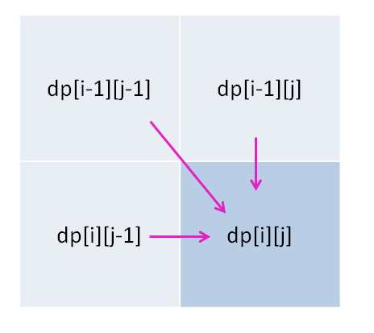

# 一、 动态规划技巧

## 1 认识动态规划
### 1.1 动态规划特点1
&emsp;（i）动态规划一般都是求<font color=#ff0000 size=5>**最值**</font>问题。比如最长递增子序列(LIS)、最大子序和、最长公共子序列(LCS)、最长回文子序列(LPSS)、最长回文子串
&emsp;（ii）核心问题的<font color=#ff0000 size=5>**穷举**</font>，但是这是一种有智慧的穷举，而非暴力穷举。<font color=#ff0000>最值问题一般都需要穷举所有的情况，之后比较才知道最值</font>。如果一个最值问题，暴力穷举的时间复杂度**爆炸**，就可以考虑动态规划

### 1.1 动态规划特点2
&emsp;（i）存在<font color=#ff0000 size=5>**重叠子问题**</font>。暴力穷举下，效率十分低，消除**重叠子问题**的两种办法：**1. 备忘录(自上而下)**；**2. DP table(自底而上)**
<div center></div>
&emsp;备注：假如计算顺序按照左单支方向，计算f(20)->f(19)->f(18)->f(17)，这时候右子树的f(18)、f(17)就可以不用计算了，直接从之前**备忘录**中读取，动态规划都存在**大量的重叠子问题**

&emsp;（ii）<font color=#ff0000 size=5>**最优子结构**</font>。最优子结构是一些问题的特性，并不是动态规划专有的，也就是<font color=#ff0000>**具有重叠子问题的最优子结构叫做动态规划**</font>， 然而很多问题不具有重叠子问题，也就不能归结在动态规划中。
&emsp;**最优子结构**：可以从子问题的最优结果推出更大问题的最优结构，也就是子问题是<font color=#ff0000>**相互独立**</font>的。最优子结构是动态规划的必要条件，大部分最值问题都具有最优子结构。比如，知道了每个班的最高分，那么马上可以推出全校的最高分。反例，知道每个班的最大分数差，能推出全校的最大分数差吗？使用暴力法解决这个问题，你可以两两求出分数差，之后求最大值，虽然每个班的最大分数差不符合最优子结构，但是任意两个同学的分数差是符合最优子结构的


### 1.2 动态规划三要素
&emsp;（i）明确**状态**、**选择**。**状态**，决定决定dp数组的维度，一般的动态规划最多二维。**选择**，什么会导致状态发生改变，比如0-1背包问题的选择只有两种，选择或者不选择
&emsp;（ii）定义**dp数组，明确初始条件(base case)**，**状态**的维度决定dp数组的维度，dp数组的选择直接决定了状态的转移，有时候需要多次修改dp数组解决问题
&emsp;（iii）寻找**状态转移**，寻找**状态**之间的关系


### 1.3 动态规划思路流程
&emsp;（i）定义**dp数组，明确初始条件(base case)**
&emsp;（ii）寻找**状态转移**
&emsp;（iii）确定**遍历方向**及**返回值**
&emsp;（iv）能否进行**状态压缩**

#### 1.3.1 自底而上模板--DP table
```C++
/**<初始化base case */
dp[0][0][...] = base case;
/**<状态转移 */
for 状态1 in 状态1的所有取值:
	for 状态2 in 状态2的所有取值:
		for ...
			dp[状态1][状态2][...] = 求最值(选择1, 选择2, ...);
```

#### 1.3.1 自上而下模板--备忘录
```python
dp(i, j, ...) :
    # 如果已经计算过，直接读取即可
    if (i,j, ...) in memo:
        return memo[(i, j, ...)]
    # 状态转移方程
    memo[(i, j, ...)] = 求最值(dp(i_change, j_change, ...), dp(i_change, j_change, ...), ...)

    return memo[(i, j, ...)]
```


### 1.4 二维动态规划的遍历方向
&emsp;（i）一维动态规划的遍历方向要么**从前往后**，要么**从后往前**，根据题目很容易推测。然而二维动态规划，只有在状态转移方程已知结合**状态转移图**才知道正确的遍方向
&emsp;（ii）一般而言有两种典型的方式：<font color=#ff0000>**1. 从上往下，从左往右；2. 从下往上，从左往右。有时候也是斜着遍历方向**</font>

#### 1.4.1 从上往下，从左往右
&emsp;（i）这种方式最常见，比如最长公共子序列、编辑距离等
```C++
for (int i = 0; i <= m; ++i) {
    for (int j = 0; j <= n; ++j) {
        ...
    }
}
```
<div align=center></div>

#### 1.4.2 从上往下，从左往右
&emsp;（i）这种方式经常出现在**回文**的问题中，比如最长回文子序列、最长回文子串、让字符串成为回文串的最少插入次数
```C++
/**<法1：如下图，右侧图所示 */
for (int i = n-2; i >= 0; --i) {
    for (int j = i+1; j < n; ++j) {
        ...
    }
}
```
&emsp;（ii）有时候**斜着**遍历也是可以的
```C++
/**<法2：如下图，左侧图所示 */
for (int len = 2; len <= n; ++len) {    /**<len是处理字串的长度 */
    for (int i = 0; i+len <= n; ++i) {  /**<i是起点 */
        int j = len + i -1;             /**<j是终点 */
        ...
    }
}
```
&emsp;（iii）<font color=#ff0000>当然推荐使用第一种方法，减少记忆的负担</font>，法2每次都要计算终点的位置
<div align=center></div>

## 2 一维动态规划
### 2.1 零钱兑换问题 322
&emsp;（i）零钱兑换是经典的一维动态规划问题
&emsp;（ii）问题描述：有k种不同面值的硬币，给定一个总金额amount，问至少要多少枚硬币凑出amount，凑不出返回-1
<div align=center></div>

#### 2.1.1 问题思路  
&emsp;（i）**dp数组，明确初始条件(base case)**：
```C++
        dp[i]:目标金额为i时，需要最少的硬币数量
        初始条件:dp[0]=0，金额为0时，不需要硬币
```
&emsp;（ii）**状态转移** 
$$
    dp[i] = min(dp[i], 1+dp[i-coins[j]]), \; s.t. \; i \geq coins[j], \; j \in(0, lengthOfCoins)
$$
&emsp;（iii）确定**遍历方向**及**返回值**
```C++
        遍历方向:从左至右
        返回值：dp[amount]
```
&emsp;（iv）能否进行**状态压缩**
```C++
        不能进行状态压缩，因为每次计算dp[i]的时候与dp[i-coins[j]]有关，无法压缩
```

#### 2.1.2 参考代码
```C++
int coinChange(vector<int>& coins, int amount) {
    vector<int> dp(amount + 1, amount+1);                   /**<由于需要求最小值，刚开始赋值成不可能的总金额amount+1 */
    /**<base case: dp[0]=0 */
    dp[0] = 0;

    int n = coins.size();
    for (int i = 1; i <= amount; ++i) {
        for (int j = 0; j < n; ++j)                         /**<遍历数组coins */
            if((i - coins[j]) >= 0)
                dp[i] = min(dp[i - coins[j]] + 1, dp[i]);
    }
    return dp[amount] == amount+1 ? -1 : dp[amount];        /**<最后的元素没有改变，不能找零 */
}
```

### 2.2 最长递增子序列(LIS) 300
&emsp;（i）零钱兑换是经典的一维动态规划问题
&emsp;（ii）问题描述：有k种不同面值的硬币，给定一个总金额amount，问至少要多少枚硬币凑出amount，凑不出返回-1
<div align=center></div>

#### 2.2.1 问题思路  
&emsp;（i）**dp数组，明确初始条件(base case)**：
```C++
        dp[i]:以nums[i]结尾的最长递增子序列长度
        初始条件:dp[...]=1，至少有一个数字
```
&emsp;（ii）**状态转移** 
$$
    dp[i] = max(dp[i], 1+dp[j]), \; s.t. \; nums[j] < nums[i], \; j \in(0, i)
$$
&emsp;（iii）确定**遍历方向**及**返回值**
```C++
        遍历方向:从左至右
        返回值：返回dp数组种最大值
```
&emsp;（iv）能否进行**状态压缩**
```C++
        不能进行状态压缩，因为每次计算dp[i]的时候与dp[j]有关，而j一直在改变，无法压缩
```


#### 2.2.2 参考代码
```C++
int lengthOfLIS2(vector<int>& nums) {
    int size = nums.size();
    vector<int> dp(size);
    fill(dp.begin(), dp.end(), 1);          /**<初始状态 */

    for(int i = 0; i < size; ++i) {
        for (int j = 0; j < i; ++j) {
            if(nums[j] < nums[i])           /**<只要发现前面的数值较小，dp[i]=max(最长子序列+1, dp[i]) */
                dp[i] = max(dp[i], dp[j] + 1);
        }
    }

    int res = 0;                            /**<循环一次，寻找最大值 */
    for (int i = 0; i < size; ++i) {
        res = max(res, dp[i]);
    }
    return res;
}
```


### 2.3 单词拆分 139
&emsp;（i）问题描述：给定一个无序数组，找出最长递增子序列长度
<div align=center></div>

#### 2.3.1 问题思路  
&emsp;（i）**dp数组，明确初始条件(base case)**：
```C++
        dp[i]:s[0,...,i]能否用wordDict凑出
        初始条件:dp[0]=true，空串不需要凑
```
&emsp;（ii）**状态转移** 
$$
dp[i] = (dp[j] \;  \&\&  \; s[i,..,j]  \; in  \; wordDict?), \; j \in(0, i)
$$
&emsp;（iii）确定**遍历方向**及**返回值**
```C++
        遍历方向:从左至右
        返回值：dp[n]
```
&emsp;（iv）能否进行**状态压缩**
```C++
        不能进行状态压缩，因为每次计算dp[i]的时候与dp[j]有关，而j一直在改变，无法压缩
```

#### 2.3.2 参考代码
```C++
bool wordBreak(string s, vector<string>& wordDict) {
    unordered_set<string> memo;
    for (const auto& e : wordDict)
        memo.insert(e);                                         /**<节省查找时间 */

    int n = s.size();
    vector<bool> dp(n + 1, false);
    /**base case: 空串不需要凑 */
    dp[0] = true;

    for (int i = 1; i <= n; ++i) {
        for (int j = 0; j < i; ++j) {
            if(dp[j] && memo.count(s.substr(j, i-j))) {         /**<分成两块，前面+后面，后面必须要在字典中 */
                dp[i] = true;
                break;
            }
        } 
    }
    return dp[n];
}
```


### 2.4 最大数组和 53
&emsp;（i）问题描述：给定一个无序数组，找出子数组和的最大值
<div align=center></div>

#### 2.4.1 问题思路  
&emsp;（i）**dp数组，明确初始条件(base case)**：
```C++
        dp[i]:以nums[i]结尾的"最大数组和"
        初始条件:dp[0]=nums[0], 第一个元素最大和是本身
```
&emsp;（ii）**状态转移**
&emsp;（1）显然有两种方式
&emsp;（2）与前面子数组相邻，形成一个更大的子数组，由于子数组是<font color=#ff0000>**连续**</font>，那么和是dp[i-1]+nums[i]
&emsp;（3）不和前面的子数组相邻，自己自成一派
$$
res = max(nums[i], dp[i-1]+nums[i])
$$
&emsp;（iii）确定**遍历方向**及**返回值**
```C++
        遍历方向:从左至右
        返回值：dp数组中的最大值
```

#### 2.4.2 参考代码
```C++
int maxSubArray(vector<int>& nums) {
    int size = nums.size();
    if (size == 0) return 0;
    vector<int> dp(size);
    dp[0] = nums[0];                    /**<base case: 第一个元素结尾的就是第一个元素值 */

    for (int i = 1; i < size; ++i) {
        dp[i] = max(nums[i], dp[i - 1] + nums[i]);
    }

    int res = INT_MIN;                  /**<寻找最大值 */
    for (int i = 0; i < size; ++i) {
        res = dp[i] > res ? dp[i] : res;
    }
    return res;
}
```

#### 2.4.3 一维动态规划的状态压缩
&emsp;（i）由状态方程可以看出，**dp[i]只和前面的dp[i-1]有关**，所以可以进行状态压缩，原来的一维dp数组压缩成两个变量，即O(n)变成O(1)
&emsp;（ii）这里直接用两个变量dp0和店铺表示，dp0在前也就是dp[i-1]
&emsp;（iii）一次循环后，dp0和dp1同时后移，<font color=#ff0000 size=5>**注意：后移简单，前移需要一个缓存**</font>
```C++
int maxSubArray(vector<int>& nums) {
    int size = nums.size();
    if (size == 0) return 0;

    int dp0 = nums[0];                    /**<第一个元素结尾的就是第一个元素值 */
    int dp1 = 0;                          /**<dp[i]只和dp[i-1]有关，这里只定义了两个变量 */

    int res = dp0;                        /**<寻找最大值 */
    for (int i = 1; i < size; ++i) {
        dp1 = max(nums[i], dp0 + nums[i]);
        dp0 = dp1;
        
        res = dp1 > res ? dp1 : res;
    }
    return res;
}
```

## 3 二维动态规划
### 3.1 0-1背包问题
&emsp;（i）背包问题可以分为**0-1背包**、**完全背包**、**多重背包**。其中0-1背包是最简单的二维动态规划问题
&emsp;（ii）问题描述：一个最大载重为W的背包、N个物品(每个物品有两个属性--重量和价值)，用背包装物品，最多可装多少价值的物品？
<div align=center></div>
&emsp;（iii）对于背包问题的**选择**只有两种：装入背包、不装入背包；**状态**也只有两个：**背包的容量w**、**可选的物品**，因此是二维动态规划

#### 3.1.1 问题思路  
&emsp;（i）**dp数组，明确初始条件(base case)**：
```C++
        dp[i][j]:对于前i个物品，当背包重量是j时，背包的最大价值
        初始条件:dp[...][0]=dp[0][...]=0，背包容量为0、或者没有物品，背包的价值都是0
```
&emsp;（ii）**状态转移** 
$$
    dp[i][j] = max(把物品i装入背包, \; s.t. \; j \geq weightOf\_i \\
                    不把物品i装入背包)
$$
&emsp;（iii）确定**遍历方向**及**返回值**
```C++
        遍历方向:从上到下，从左到右
        返回值：dp[m][n]
```
&emsp;（iv）能否进行**状态压缩**
```C++
        很多问题都可以进行状态压缩，比如将空间复杂度从2维降至1维
```

#### 3.1.2 参考代码
```C++
int 0_1knapsack(int weight, int n, ...):
    int dp[m+1][n+1];
    /**<base case:dp[...][0]=dp[0][...]=0 */
    dp[...][0]=dp[0][...]=0;

    for i in [1...m]:
        for j int [1...n]:
            if j >= weightOf_i
                dp[i][j] = max(把物品i装入背包, 不把物品i装入背包);
            else
                dp[i][j] = 不把物品i装入背包;
    return dp[m][n];
```


### 3.2 分割等和子集 416
&emsp;（i）问题描述：一个只含正整数的非空数组，是否可以把数组分割成两部分，使得两部分的和相等？
<div align=center></div>
&emsp;（ii）这是一个0-1背包的变体，等价于<font color=#ff0000>**背包的容量w是数组总和的一半**</font>，问数组中的物品能否恰好装满背包？
&emsp;（ii）当数组总和是奇数，直接返回false，不可分

#### 3.2.1 问题思路  
&emsp;（i）**dp数组，明确初始条件(base case)**：
```C++
        dp[i][j]:物品为nums[0,...i]，背包重量是j时，能否恰好装满背包
        初始条件:dp[...][0]=true，背包容量为0、这时候不用装，同时背包也满了，true
```
&emsp;（ii）**状态转移** 
&emsp;（1）背包容量还够，取装、不装两种结果的**或**
&emsp;（2）背包容量不够，直接取不装的结果
&emsp;（3）<font color=#ff0000>由于nums数组在dp数组中补了一个，所有这里对应原始的nums需要减1, 即nums[i-1]</font>
$$
dp[i][j] = \begin{cases}
                    dp[i - 1][j] \; || \; dp[i-1][j - nums[i-1]], \; s.t. \; j \geq nums[i-1] \\
                    dp[i - 1][j], \; otherwise
                \end{cases}
$$
<div align=center></div>

&emsp;（iii）确定**遍历方向**及**返回值**
```C++
        遍历方向:从上到下，从左到右，i的起点为1，j的起点为（若数组nums中没有0的话，就是从1开始）
        返回值：dp[m][n]
```
&emsp;（iv）能否进行**状态压缩**
&emsp; 这里的第二层循环要反向遍历？如果从前往后，将会导致前面的结果被覆盖，进而影响后面的结果

```C++
        1. 将dp数组的二维空间压缩成一维空间，即只使用原始dp数组的一行      vector<bool> dp(sum+1,false);
        2. 初始条件(base case)                     dp[0] = true;       /**<当金额为0，不用凑，为真 */
        3. 遍历方向：从上到下，从右到左，i的起点为0，j的终点为1（0也可以，主要看数组中是否有0）
        bool canPartition(vector<int>& nums) {
            int sum = 0;
            for (const auto e : nums)
                sum += e;
            if (sum%2 == 1) return false;

            sum = sum / 2;
            vector<bool> dp(sum+1,false);
            /**<当金额为0，不用凑，为真 */
            dp[0] = true;

            int n = nums.size();
            for (int i = 0; i < n; ++i) {
                for (int j = sum; j >= 1; --j) {                    /**<这里要倒序，因为上次内容不因该覆盖*/
                    if ((j - nums[i]) >= 0)
                        dp[j] = dp[j] || dp[j - nums[i]];
                }
            }
            return dp[sum];
        }
```

#### 3.2.2 参考代码
```C++
bool canPartition(vector<int>& nums) {
    int sum = 0;
    for (const auto e : nums)
        sum += e;
    if (sum%2 == 1) return false;

    int m = nums.size();
    sum = sum / 2;
    vector<vector<bool>> dp(m+1, vector<bool>(sum+1, false));
    /**<当金额为0，不用凑，为真 */
    for (int i = 0; i <=m; ++i)
        dp[i][0] = true;

    for (int i = 1; i <= m; ++i) {
        for (int j = 1; j <= sum; ++j) {
            if((j - nums[i-1]) >= 0)                    /**<不装入，装入(用剩下的i-1个物品，装入j-nums[i-1]) */
                dp[i][j] = dp[i - 1][j] || dp[i-1][j - nums[i-1]];        /**<物品从0号开始 */
            else                                        /**<容量不足，无法装入 */
                dp[i][j] = dp[i - 1][j];
        }
    }
    return dp[m][sum];
}
```

### 3.3 最长公共子序列(LCS) 1143
&emsp;（i）问题描述：给定两个字符串text1和text2，求取最长公共子序列。注意子序列和子串不同，子序列中字符可能不挨着一起，而子串是挨着一起的
<div align=center></div>

#### 3.3.1 问题思路  
&emsp;（i）**dp数组，明确初始条件(base case)**：
$$
    dp[i][j] = \begin{cases}
                    text1[0,...,i] \\
                    text2[0,...,j] 
                \end{cases}
    的最长公共子序列
$$
```C++
        初始条件:dp[...][0]=dp[0][...]=0，两个字符串其中一个是空串，则LCS为0
```
&emsp;（ii）**状态转移** 
&emsp;（1）若text1[i-1] == text2[j-1]相等，最长公共前缀加1
&emsp;（2）若不相等，**至少有一个**字符不在lcs中。则求一个最大值--text1[i]不在lcs中、text2[j]不在lcs中，需不需要求解两个都不在lcs中呢？

<div align=center></div>

&emsp;（3）<font color=#ff0000>由于nums数组在dp数组中补了一个，所有这里对应原始的nums需要减1, 即nums[i-1]</font>
$$
    dp[i][j] = \begin{cases}
                    dp[i-1][j-1] + 1, \quad \quad \quad \quad s.t.\; text1[i-1]==text2[j-1] \\
                    max(dp[i-1][j], dp[i][j-1]), s.t. \; text1[i-1]!=text2[j-1] 
                \end{cases}
$$
<div align=center></div>

&emsp;（iii）确定**遍历方向**及**返回值**
```C++
        遍历方向:从上到下，从左到右
        返回值：dp[m][n]
```
&emsp;（iv）能否进行**状态压缩**
```C++
        可以进行状态压缩
```

#### 3.3.2 参考代码
```C++
int longestCommonSubsequence(string& text1, string& text2) {
    int m = text1.size();
    int n = text2.size();

    /**<base case若两个字符串有空串，则返回0，即0行和0列*/
    vector<vector<int>> dp(m + 1, vector<int>(n + 1, 0));
    for (int i = 0; i <= m; ++i) {
        for (int j = 0; j <= n; ++j) {
            if(text1[i-1] == text2[j-1])                    /**<若两个字符相等， 则LCS加1*/
                dp[i][j] = 1 + dp[i - 1][j - 1];
            else                                            /**<若两个字符不相等，则比较两者形式，取最大值 */
                dp[i][j] = max(dp[i - 1][j], dp[i][j - 1]);
        }
    }
    return dp[m][n];                                        /**<dp数组向右下角递增 */
}
```


### 3.4 最长回文子序列 516
&emsp;（i）回文问题的核心是<font color=#ff0000 size=5>**从中间往两边扩散**</font>
&emsp;（ii）问题描述：给定一个字符串s，找出最长的回文子序列
&emsp;（iii）例如，输入是"aecda"，返回结果为3，最长回文子序列是"aca"

#### 3.4.1 问题思路  
&emsp;（i）**dp数组，明确初始条件(base case)**：
```C++
        dp[i][j]:s[i,...,j]的最长回文子序列
        初始条件:dp[i][j]=1, s.t. i==j，回文问题初始条件都是主对角线为1，因为一个字符也是回文
```
&emsp;（ii）**状态转移** 
```C++
    （1）初始状态是1个字符，由内逐渐往外增大。利用归纳假设思想，初始时刻已知为1，假设在n-1时刻最长公共子序列已知dp[i+1][j-1]，求解在n时刻的最长公共子序列dp[i][j]？
```
<div align=center></div>
```C++
    （2）有两种情况：s[i]和s[j]相等，s[i]和s[j]不相等。如果相等，则最长公共子序列加2，如果不相等呢？
    （3）直接取最大值--dp[i+1][j]和dp[i][j-1]d
```
<div align=center></div>
$$
    dp[i][j] = \begin{cases}
                    dp[i+1][j-1] + 2, \quad \quad \quad \quad s.t.\; s[i]==s[j] \\
                    max(dp[i+1][j], dp[i][j-1]), s.t. \; s[i]!=s[j] 
                \end{cases}
$$
<div align=center></div>

&emsp;（iii）确定**遍历方向**及**返回值**
```C++
        遍历方向:从下到上，从左到右
        返回值：dp[0][n]
```

#### 3.4.2 参考代码
```C++
int longestPalindromeSubseq(string& s) {
    int size = s.size();
    vector<vector<int>> dp(size, vector<int>(size, 0));
    /**<base case, 一个字母就是回文 */
    for (int i = 0; i < size; ++i)
        dp[i][i] = 1;

    for(int i = size-2; i >= 0; --i) {
        for(int j = i+1; j < size; ++j) {                      /**<从下至上，从左至右的有上三角 */
            /**<状态转移方程 */
            if (s[i] == s[j])                                   /**<若相等，则最长回文子序列增加2 */
                dp[i][j] = dp[i + 1][j - 1] + 2;
            else                                                /**<若不相等，分别将左边的i和右边的j加入，取得最大值 */
                dp[i][j] = max(dp[i][j - 1], dp[i + 1][j]);
        }
    }
    return dp[0][size - 1];                                     /**<返回右上角 */
}
```

#### 3.4.3 二维动态规划的状态压缩
&emsp;（i）目标：将二维状态dp数组压缩成一维数组，也就是二维数组如何降维**投影**到一维数组上。如图，一个很大的问题，原来的四个空间被压缩成两块空间，怎么让一个空间存储两个值？
<div align=center></div>

&emsp;（ii）初始条件：简单的**投影**，你会发现初始值就是一维dp数组全为1
<div align=center></div>

&emsp;（iii）遍历的结构不用改变，首先要明白的是，此时数组存的是啥？对于上图中，**第一个元素存的是3**，而不是2(被覆盖了)；**第二个元素存的是1**，而不是4，因此节省了1/2的存储空间
&emsp;（iv）那么2去哪儿了呢？用**pre提前保存**起来了，因为2被覆盖了；那么4去哪儿了呢？由于**4是结果**，因此最终结果计算出来后，直接覆盖1（此时还没覆盖1哦！）
&emsp;（v）既然需要pre提前保存，那么什么时候恢复值呢？内层循环最后，也就是pre在前，temp在后,同时后移。最后pre的初值为0，也就是主对角线下的无效值0
```C++
int longestPalindromeSubseq(string& s) {
    int size = s.size();
    /**<base case, 一个字母就是回文 */
    vector<int> dp(size, 1);

    for(int i = size-2; i >= 0; --i) {
        int pre = 0;
        for (int j = i + 1; j < size; ++j) {                    /**<从下至上，从左至右的有上三角 */
            int temp = dp[j];
            if (s[i] == s[j]) /**<若相等，则最长回文子序列增加2 */
                dp[j] = pre + 2;
            else                                                /**<若不相等，分别将左边的i和右边的j加入，取得最大值 */
                dp[j] = max(dp[j - 1], dp[j]);
            pre = temp;
        }
    }
    return dp[size - 1];                                     /**<返回右上角 */
}
```