# 一、 回溯法技巧

## 1 认识回溯法
### 1.1 动态规划特点
&emsp;（i）回溯法作为递归算法的一个分支，通常动态规划是一种有<font color=#ff0000 size=5>**智慧**</font>的暴力穷举，而回溯法则是<font color=#ff0000 size=5>**简单粗暴**</font>的暴力穷举
&emsp;（ii）回溯算法的时间复杂度都很高，一般是次方，甚至指数时间复杂度。而动态规划的时间复杂度都比较低，是因为使用了状态转移方程消除了重叠子问题
&emsp;（iii）解决一个回溯问题，实际上就是<font color=#ff0000 size=5>**遍历决策树**</font>的问题

### 1.2 回溯三要素
&emsp;（i）**结束条件**，达到决策底层，无法再进行决策
&emsp;（ii）**路径(track)**：已经做出的决策
&emsp;（iii）**选择列表**：当前可以做的决策
&emsp;（iv）<font color=#ff0000 size=5>**剪枝条件**</font>：排除重复的元素

### 1.3 回溯算法框架
```python
result = []
def backtrack(路径, 选择列表):
    if 满足结束条件:
        result.add(路径)
        return

    for 选择 in 选择列表:
        是否需要剪枝？？？
        做选择
        backtrack(路径, 选择列表)
        撤销选择
```

#### 1.3.1 理解回溯法
&emsp;（i）回溯法的核心在内部的for循环，<font color=#ff0000 size=5>**决策树其实是一颗N叉树**</font>，所以回溯法也是树的遍历
```C++
void traverse(TreeNode root) {
    for (TreeNode child : root.childern)
        // 前序遍历需要的操作
        traverse(child);
        // 后序遍历需要的操作
}
```
<div align=center>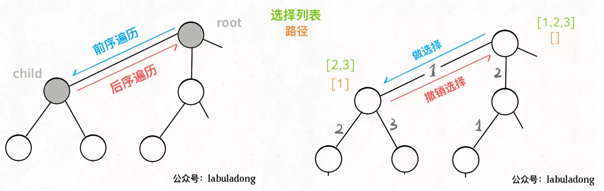</div>

&emsp;（ii）backtrack函数其实就像一个指针，在这棵树上游走，<font color=#ff0000 size=5>**同时要正确维护每个节点的属性**</font>，每当走到树的底层，停止回溯
&emsp;（iii）**确维护每个节点的属性**：访问结点前做选择，将选择加入路径track中；访问节点后撤销选择，将选择从track移除
&emsp;（iv）回溯算法的重点是**结束条件**、**先序应该做什么**、**回溯法的形参有什么(显然track路径一定有，问题形参也要有，还有,,,)**，最后**后序**很简单，只需要弹出最后的元素即可
&emsp;（v）**选择列表和剪枝**：清楚当前的选择是什么，<font color=#ff0000 size=5>**需不需要剪枝**</font>，也就是for循环循环变量的起点和终点很重要


## 2 基础问题
### 2.1 全排列 46
&emsp;（i）问题描述：输入不包含重复数字的数组，返回它的所有排列
&emsp;（ii）n个元素的全排列个数是$$n!$$，如下图，3个元素的全排列有$$3!=6$$个。因此全排列是阶乘时间复杂度问题，回溯法的时间复杂度都很高
<div align=center>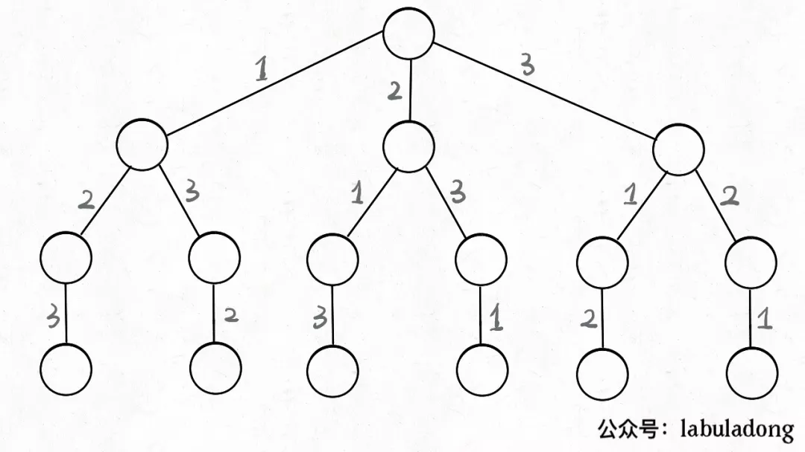</div>

#### 2.1.1 问题思路  
&emsp;（i）**结束条件**：
```C++
        当路径track长度等于数组nums长度，代表一条分支结束，将路径track存入结果中，如上图最左侧的分支(1->2->3)
```
&emsp;（ii）**选择列表与剪枝条件**
<div align=center>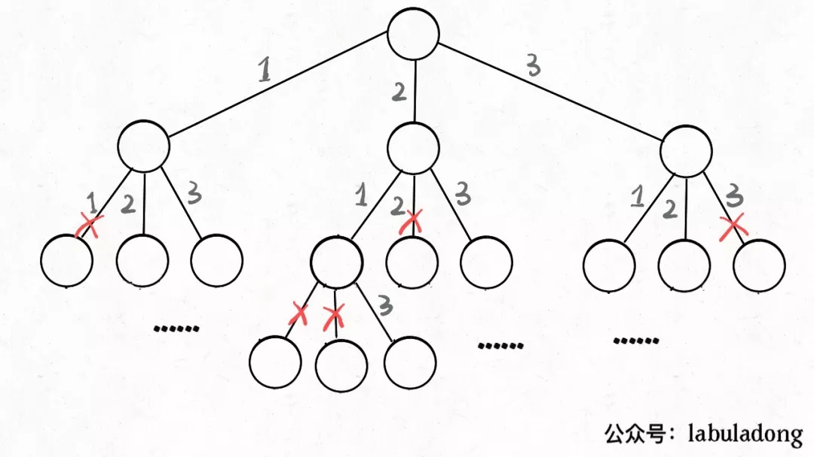</div>

```C++
        1. 对于每一个结点而言，都有nums.length个选择
        2. 上图中的”ד代表剪枝，也就是本次递归不会考虑这些不合理的情况。比如第二层最左侧结点，已经选择了1结点，这时就应该剪枝结点1，因为排列没有重复，紧接着第三层中每个结点就会剪枝掉2个不合理的结点
        3. 因此for循环每次都需要遍历nums数组
        4. 如何排除不合法的情况，在java中track可以选择list，进而用contains()方法判断
```
<div align=center>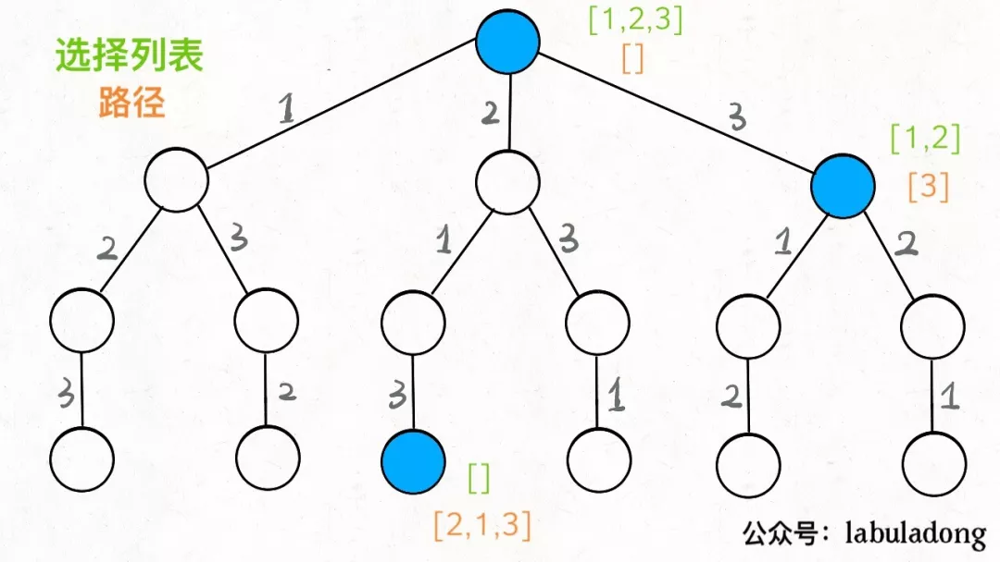</div>
&emsp;（iii）**回溯的形参** 
```C++
        1. 原始问题的参数：nums
        2. 路径：        track
```

#### 2.1.2 参考代码
```C++
vector<vector<int>> res;
void backtrack(vector<int> &nums, vector<int> &track) {
    /**<结束条件 */
    if (nums.size() == track.size()) {
        res.push_back(track);
        return;
    }

    for (int i = 0; i < nums.size(); ++i) {
        /**剪枝条件：排除重复的数字 */
        if(find(track.cbegin(), track.cend(), nums[i]) != track.cend())
            continue;
        track.push_back(nums[i]);               /**<做选择 */
        backtrack(nums, track);
        track.pop_back();                       /**<撤销选择 */
    }
}
```

### 2.2 组合 77
&emsp;（i）问题描述：给定两个数n和k，输出[1,...,n]中k个数字的组合

$$
输入: n = 4, k = 2 \\
输出:
[ [1,2], [1,3], [1,4], [2,3], [2,4], [3,4] ]
$$

#### 2.2.1 问题思路  
&emsp;（i）**结束条件**：
```C++
        由于是k的组合，所以每个track的长度都是k，即k限制了数的高度
```
<div align=center>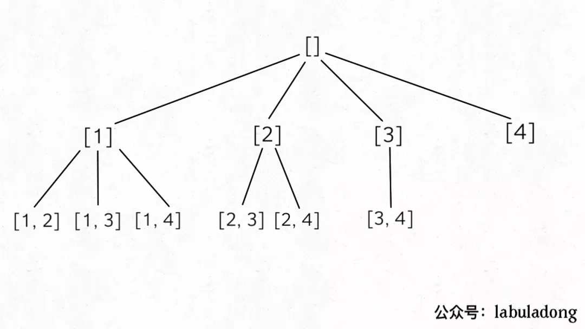</div>

&emsp;（ii）**选择列表**
```C++
        1. 组合和排列有一点最大的不同是：排列[1,2],[2,1]是两种情况，而组合是一种情况，也就是组合没有顺序之分
```
<div align=center>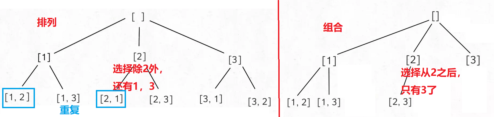</div>

```C++
        2. 如上图，排列和组合的差异就在选择列表上。组合的选择列表总是当前元素之后的位置，也就是i+1，因此代码需要额外start指示下一开始位置，同时for循环的开始也是start
        3. 下面是组合代码框架，要额外引入start
        void backtrack(..., int start, vector<int> &track) {
            /**<结束条件 */

            for (int i = start; i <= n; ++i) {
                track.push_back(i);                     /**<做选择 */
                backtrack(..., i+1, track);
                track.pop_back();                       /**<撤销选择 */
            }
        }
```
&emsp;（iii）**回溯的形参** 
```C++
        1. 原始问题的参数：n, k
        2. 组合问题的参数：start
        3. 路径：        track
```

#### 2.2.2 参考代码
```C++
vector<vector<int>> res;
void backtrack(int n, int k, int start, vector<int> &track) {
    /**<结束条件 */
    if(track.size() == k) {
        res.push_back(track);
        return;
    }

    for (int i = start; i <= n; ++i) {
        track.push_back(i);                     /**<做选择 */
        backtrack(n, k, i+1, track);
        track.pop_back();                       /**<撤销选择 */
    }
}
```


### 2.3 子集 78
&emsp;（i）问题描述：输入不包含重复数字的数组，返回它的所有子集
&emsp;（ii）n个元素的子集个数是$$2^n$$，如下图，3个元素的子集有$$2^3=8$$个。因此子集是指数时间复杂度问题，回溯法的时间复杂度都很高
<div align=center>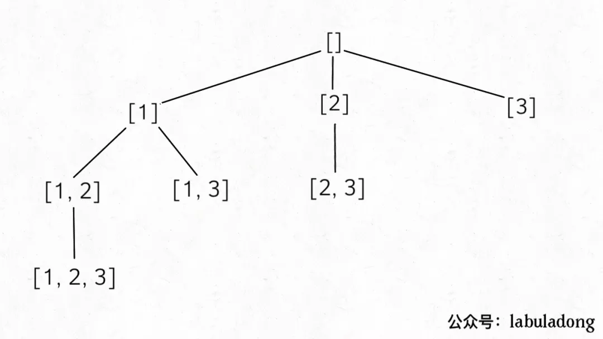</div>

#### 2.3.1 问题思路  
&emsp;（i）**结束条件**：
```C++
        不需要判断出口，因为每次执行都会产生一个结果
```
&emsp;（ii）**选择列表** 
```C++
        子集问题的回溯树和组合问题是一样的，因此选择列表也和组合一致
```
&emsp;（iii）**回溯的形参** 
```C++
        1. 原始问题的参数：nums
        2. 组合问题的参数：start
        3. 路径：        track
```

#### 2.3.2 参考代码
```C++
vector<vector<int>> res;
void backtrack(vector<int> &nums, int start, vector<int>& track) {
    /**<不需要判断出口，因为每次执行都会产生一个结果 */
    res.push_back(track);

    /**<从start开始，防止重复，子集其实是组合，不是排序 */
    for (int i = start; i < nums.size(); ++i) {
        track.push_back(nums[i]);                     /**<做选择 */
        backtrack(nums, i + 1, track);                /**<组合从下一个位置开始选！！！ */
        track.pop_back();                             /**<撤销选择 */
    }
}
```


## 3 经典问题
### 3.1 组合总和III 216
&emsp;（i）问题描述：用k个数字凑成目标n，其中数字只能是1-9，且只能使用一次
<div align=center>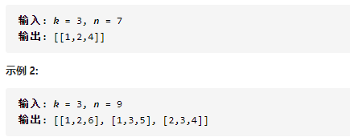</div>

#### 3.1.1 问题思路  
&emsp;（i）**结束条件**：
```C++
        1. 只能使用k个数，即track的长度为k
        2. 目标n会递减，且为0时合法；小于0非法
```
&emsp;（ii）**选择列表** 
```C++
        每次从start开始，选择最多到9
```
&emsp;（iii）**回溯的形参** 
```C++
        1. 原始问题的参数：n, k
        2. 组合问题的参数：start
        3. 路径：        track
```

#### 3.1.2 参考代码
```C++
vector<vector<int>> res;
void backtrack(int n, int k, int start, vector<int> &track) {
    /**<结束条件 */
    if(track.size() == k && n == 0) {
        res.push_back(track);
        return;
    }
    if(n < 0)                                  /**<非法目标和 */
        return;

    for (int i = start; i <= 9; ++i) {
        track.push_back(i);                     /**<做选择 */
        backtrack(n-i, k, i+1, track);
        track.pop_back();                       /**<撤销选择 */
    }
}
```


### 3.2 组合总和 39
&emsp;（i）问题描述：一个**无重复元素**的数组和一个目标数target，找出数组中所有可以使数字和为target的组合，数组中的数字可以**无限制重复**被选取
<div align=center>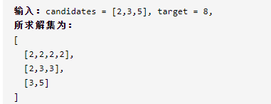</div>

#### 3.2.1 问题思路  
&emsp;（i）**结束条件**：
```C++
        1. 目标target减至0，一个合法的组合
        2. target小于0，非法，直接返回即可
```
&emsp;（ii）**选择列表** 
```C++
        由于是组合问题，所以先把组合的框架搬出来，在上面进行修改
        1. 由于元素可以无限制重复使用，所以回溯的位置从i开始
```
&emsp;（iii）**回溯的形参** 
```C++
        1. 原始问题的参数：candidates、target
        2. 组合问题的参数：start
        3. 路径：        track
```

#### 3.2.2 参考代码
```C++
vector<vector<int>> res;
void backtrack(vector<int>& candidates, int target, int start, vector<int>& track) {
    if(target == 0) {           /**<递归出口 */
        res.push_back(track);
        return;
    }
    if (target < 0)             /**<非法目标和 */
        return;

    for (int i = start; i < candidates.size(); ++i){
        track.push_back(candidates[i]);                     /**<做选择 */
        backtrack(candidates, target - candidates[i], i,track); /**<下一次也是从i开始，允许数字重复 */
        track.pop_back();                                   /**<撤销选择 */
    }
}
```
### 剪枝问题
#### 1 组合问题剪枝
&emsp;（i）数组需要排序
&emsp;（ii）由于组合每次都从start的下一个位置开始递归，因此**只要后续值相等**就可以剪枝了
```C++
    /**剪枝条件 */
    if(i>start && candidates[i]==candidates[i-1])
        continue;
```

#### 2 排列问题剪枝
&emsp;（i）数组需要排序
&emsp;（ii）排列比组合复杂，因为每次是**从除自己外剩余中选择**，因此需要额外的一个访问数组visited记录元素是否被访问
```C++
    /**剪枝条件 */
    if(visited[i] || (i>0 && nums[i]== nums[i-1] && !visited[i-1]))
        continue;
```

### 3.3 组合总和II 40
&emsp;（i）问题描述：一个数组和一个目标数target，找出数组中所有可以使数字和为target的组合，数组中的数字可以**只能用一次**
<div align=center>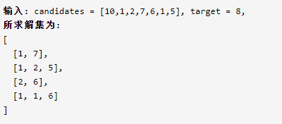</div>

#### 3.3.1 问题思路  
&emsp;（i）**结束条件**：
```C++
    1. 目标target减至0，一个合法的组合
    2. target小于0，非法，直接返回即可
```
&emsp;（ii）**选择列表** 
```C++
    不能重复的组合问题，就是组合的框架，在上面进行修改
    1. 与上题相比，这里不能重复，所以完全是组合的代码
    2. 由于这里的数组并没有说不能重复，所以这题的核心就是去重？下面直接使用组合代码的输出，发现与答案相比重复了
        1 1 6, 1 2 5, 1 7, 1 2 5, 1 7, 2 6 
        for (int i = start; i < candidates.size(); ++i) {
            track.push_back(candidates[i]);                            /**<做选择 */
            backtrack(candidates, target - candidates[i], i+1, track); /**<下一次也是从i开始，允许数字重复 */
            track.pop_back();                                          /**<撤销选择 */
        }
```
&emsp;（iii）**剪枝条件** 
```C++
    3. 如何去重？？？这里以[2,5,2,1,2], target=5为例，下面是递归树，下面是剪枝的两点
        （1）：选过的不能再选，这里用i+1就能保证，也是每个元素只能使用一次
        （2）：不能产生相同的组合，怎么做？？？为什么有相同的组合？？？
            如案例[1,2,2,2,5], 比如[1,2(第一个),2(第二个)]、[1,2(第一个),2(第三个)]，显然元素只取了一次，但是这两个其实是一样的。
```
<div align=center>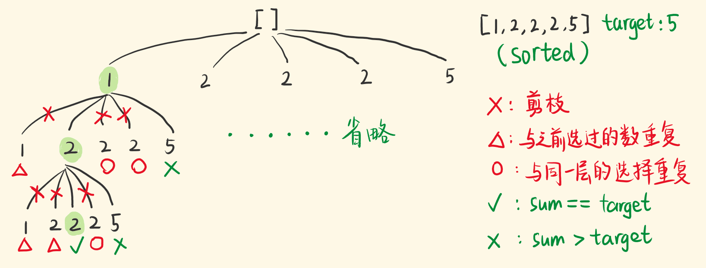</div>

&emsp; **解决办法**
```C++
        1. 先对原始数据排序
        2. 在这里，怎么让第三个2，第四个2只取一次？？？
        3. 由于是排序数组，开始位置大于start且后一个和当前位置相等，直接跳过即可
        if(i>start && candidates[i]==candidates[i-1]) {
            continue;
        }
```
&emsp;（iv）**回溯的形参** 
```C++
        1. 原始问题的参数：candidates、target
        2. 组合问题的参数：start
        3. 路径：        track
```

#### 3.3.2 参考代码
```C++
vector<vector<int>> res;
void backtrack(vector<int>& candidates, int target, int start, vector<int>& track) {
    if(target == 0) {           /**<递归出口 */
        res.push_back(track);
        return;
    }
    if (target < 0)             /**<非法目标和 */
        return;

    for (int i = start; i < candidates.size(); ++i) {
        if(i>start && candidates[i]==candidates[i-1]) {
            continue;
        }
        track.push_back(candidates[i]);                            /**<做选择 */
        backtrack(candidates, target - candidates[i], i+1, track); /**<下一次也是从i开始，允许数字重复 */
        track.pop_back();                                          /**<撤销选择 */
    }
}
```

### 3.4 子集II 90
&emsp;（i）问题描述：给定一个可包含重复数字的序列，返回所有的子集
<div align=center>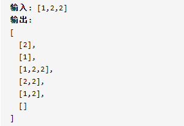</div>

#### 3.4.1 问题思路  
&emsp;（i）**结束条件**：
```C++
        不需要判断出口，因为每次执行都会产生一个结果
```
&emsp;（ii）**选择列表** 
```C++
        子集问题的回溯树和组合问题是一样的，因此选择列表也和组合一致
```
&emsp;（iii）**剪枝条件**
```C++
        剪枝条件和 组合总和II 一摸一样，对于排序数组，若当前元素和之前的相等且位于start之后，则剪枝
```
&emsp;（iv）**回溯的形参** 
```C++
        1. 原始问题的参数：nums
        2. 组合问题的参数：start
        3. 路径：        track
```

#### 3.4.2 参考代码
```C++
vector<vector<int>> res;
void backtrack(vector<int> &nums, int start, vector<int>& track) {
    /**<不需要判断出口，因为每次执行都会产生一个结果 */
    res.push_back(track);

    /**<从start开始，防止重复，子集其实是组合，不是排序 */
    for (int i = start; i < nums.size(); ++i) {
        /**剪枝条件 */
        if (i > start && nums[i] == nums[i-1])
            continue;
        track.push_back(nums[i]);
        backtrack(nums, i + 1, track);
        track.pop_back();
    }
}
```


### 3.5 全排列II 47
&emsp;（i）问题描述：给定一个可包含重复数字的序列，返回所有的全排列
<div align=center>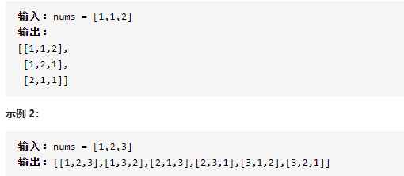</div>

#### 3.5.1 问题思路  
&emsp;（i）**结束条件**：
```C++
        当路径track长度等于数组nums长度，代表一条分支结束
```
&emsp;（ii）**剪枝条件** 
&emsp;（1）由于n个元素的全排列个数是$$n!$$，所以不管元素是否重复，结果数目不变，对于重复元素，需要剪枝，这里的剪枝条件有两个

<div align=center>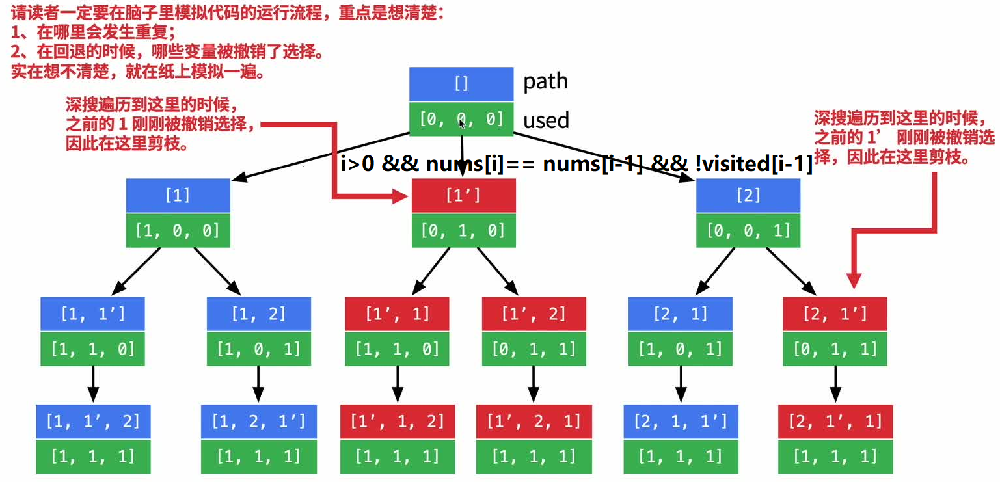</div>
&emsp;（2）visited[i]，元素不能重复，这里额外用了start
&emsp;（3）i>0 && nums[i]== nums[i-1] && !visited[i-1]：如图红色剪枝部分，由于数组已经排序，**此刻元素值和上一个元素值重复且上一个元素没有被访问**，需要剪枝

```C++
    /**剪枝条件 */
    if(visited[i] || (i>0 && nums[i]== nums[i-1] && !visited[i-1]))
        continue;        
```
&emsp;（iii）**回溯的形参** 
```C++
        1. 原始问题的参数：nums
        2. 剪枝参数：     visited
        3. 路径：        track
```

#### 3.5.2 参考代码
```C++
vector<vector<int>> res;
void backtrack(vector<int> &nums, vector<bool> &visited, vector<int> &track) {
    /**<结束条件 */
    if (nums.size() == track.size()) {
        res.push_back(track);
        return;
    }

    for (int i = 0; i < nums.size(); ++i) {
        /**剪枝条件： 排除重复的数字 */
        if(visited[i] || (i>0 && nums[i]== nums[i-1] && !visited[i-1]))
            continue;
        track.push_back(nums[i]);               /**<做选择 */
        visited[i] = true;
        backtrack(nums, visited, track);
        visited[i] = false;
        track.pop_back();                       /**<撤销选择 */
    }
}
```
