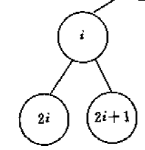
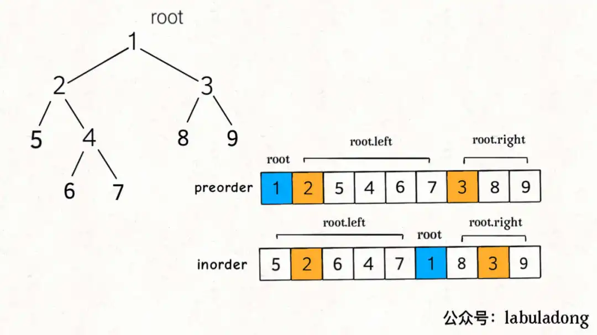
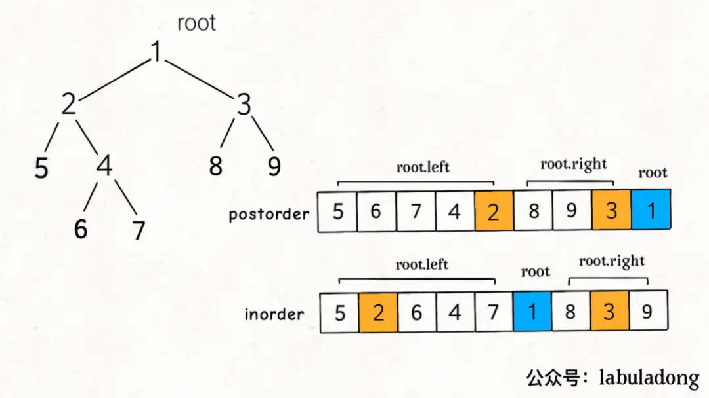

# 一、 二叉树的技巧

## 1 创建、释放、层序遍历二叉树
### 1.1 创建二叉树
&emsp;（i）leetcode中输入都是二叉树数组储存方式
&emsp;（ii）二叉树的数组存储方式是很容易建立二叉树
&emsp;（iii）对于结点i，它的左子树是**2*i**，右子树是**2*i+1**，由于数组存储是从0开始，所以下面的代码会+1
&emsp;（iv）为了更方便的存储，实际上将输入的null特意改成-1
&emsp;（v）创建使用典型的<font color=#ff0000>先序遍历</font>，合符情理-创建从上至下

<div align=center></div>

#### 1.1.1 参考代码
```C++
TreeNode* creatTree(std::vector<int> nums, int i){
    if(i >= nums.size() || nums[i] == -1)               /**<出现无效下标 或者值为1均返回nullptr */
        return nullptr;

    TreeNode *root = new TreeNode(nums[i]);             /**<创建根 结点 */
    root->left = creatTree(nums, 2*i+1);                /**<创建左子树 */
    root->right = creatTree(nums, 2*i+2);               /**<创建右子树 */

    return root;
}
```

### 1.2 释放二叉树
&emsp;（i）与创建相反，释放采用<font color=#ff0000>后序遍历</font>，显然，符合清理，从下至上依次删除

#### 1.2.1 参考代码
```C++
void freeTree(TreeNode* root) {
    if(root == nullptr)
        return;
    freeTree(root->left);
    freeTree(root->right);
    delete root;
}
```

### 1.3 层序遍历二叉树
&emsp;（i）为了方便输出显示，这里使用层序输出，很容易观察结果的正确性
&emsp;（ii）层序遍历是典型的BFS，核心数据结构是<font color=#ff0000>队列</font>，树和图广度优先是通用的，都是<font color=#ff0000>队列</font>
&emsp;（iii）思路：先将根结点入队列，之后取出根结点，将它的左子树、右子树依次入队列，如此反复，直到队空

#### 1.3.1 参考代码
```C++
void printTree(TreeNode* root) {
    if(root == nullptr)
        return;

    std::queue<TreeNode*> Q;
    Q.push(root);

    while (!Q.empty()) {
        TreeNode *node = Q.front(); Q.pop();
        std::cout << node->val << " ";
        if (node->left) Q.push(node->left);
        if (node->right)  Q.push(node->right);
    }
}
```

### 1.4 中序遍历二叉树
&emsp;（i）中序递归代码可以转成非递归代码，此时将需要用到<font color=#ff0000>栈</font>
&emsp;（ii）思路：访问顺序左子树、根结点、右子树。递归和非递归的思路一致

#### 1.4.1 参考代码
```C++
vector<int> res;
void helper(TreeNode *root) {
    if(root == nullptr)
        return;

    helper(root->left);
    res.push_back(root->val);
    helper(root->right);
}

vector<int>& inorderTraversal(TreeNode* root) {
    helper(root);
    return res;
}
```

#### 1.4.2 参考代码
&emsp;（i）具体思路是**栈不空或者p不空**，开始一直向左走并入栈；弹出根结点；向右走；
```C++
vector<int> res;
void helper(TreeNode* root) {
    if(root == nullptr)
        return ;
    
    stack<TreeNode*> sta;
    TreeNode *p = root;

    while (!sta.empty() || p) {                       /**<什么时候栈空了但是p不空？根节点遍历完成即将遍历根的右子树 */
        while(p) {                                    /**<一直向左走到底，先压入根结点再向左走 */
            sta.push(p);
            p = p->left;
        }

        p = sta.top(); sta.pop();                     /**<弹出的是根结点 */
        res.push_back(p->val);
        p = p->right;                                 /**<处理右子树 */
    }
}

vector<int>& inorderTraversal(TreeNode* root) {
    helper(root);
    return res;
}
```


## 2 递归思想
大部分树的问题都可以使用递归来解决，二叉树三种经典遍历方式：前序遍历、中序遍历、后序遍历。除了三种方式外，还有层序遍历。这四种遍历方式适合不同的场合，有如下规律。
&emsp;（i）在某些时候，适合前序遍历的题目，同时后序遍历也可完成，反之依然。
&emsp;（ii）**前序遍历可以理解成从上到下执行，而后序遍历理解成从下到上执行**
&emsp;（iii）层序遍历就是BFS，核心数据结构是队列
&emsp;（iv）中序遍历的非递归算法，核心数据结构是栈
&emsp;（iii）前序遍历、中序遍历、后序遍历其实对应图遍历的DFS
<font color=#ff0000 size=4>**将题目细化，搞清楚根结点应该做什么，剩下的交给前序、中序、后序遍历**</font>
```C++
void traverse(TreeNode* root) {
    // 前序遍历
    traverse(root->left)
    // 中序遍历
    traverse(root->right)
    // 后序遍历
}
```

### 2.1 二叉树的结点总数
&emsp;（i）如何计算总结点数呢？
&emsp;（ii）先计算左子树结点总数，之后计算右子树结点总数，最后加上根结点1
&emsp;（iii）确定后序遍历
&emsp;（iv）递归出口：空指针直接返回0

#### 2.1.1 参考代码
```C++
int count(TreeNode* root) {
    if(root == nullptr) return 0;
    return count(root->left) + count(root->right) + 1;
}
```

### 2.2 二叉树的最大深度 104
&emsp;（i）和上题类似，如何计算二叉树的最大深度呢？
&emsp;（ii）先计算左子树最大深度，之后计算右子树最大深度，取较大者，最后加上根结点1
&emsp;（iii）确定后序遍历
&emsp;（iv）递归出口：空指针直接返回0

#### 2.2.1 参考代码
```C++
int maxDepth(TreeNode* root) {
    if(root == NULL)
        return 0;
    int leftDepth = maxDepth(root->left);
    int rightDepth = maxDepth(root->right);
    return (leftDepth >= rightDepth) ? leftDepth + 1 : rightDepth + 1;
}
```
#### 2.2.2 BFS层序遍历
```C++
int maxDepth(TreeNode* root) {
    if(root == nullptr)
        return 0;
    
    int depth = 0;
    queue<TreeNode *> Q;
    Q.push(root);
    while (!Q.empty()) {
        int size = Q.size();
        while (size > 0) {
            TreeNode *node = Q.front(); Q.pop();
            if(node->left)  Q.push(node->left);
            if(node->right)  Q.push(node->right);
            --size;
        }
        ++depth;
    }
    return depth;
}
```

### 2.3 翻转二叉树 226
&emsp;（i）如何翻转二叉树呢？直接交换左右子树即可。
&emsp;（ii）后序遍历：相当于从下往上依次交换
&emsp;（iii）先序遍历：相当于从上往下依次交换
&emsp;（iv）中序是不可以的，为什么？

#### 2.3.1 参考代码
```C++
TreeNode* invertTree(TreeNode* root) {
    /**<前序或者后序遍历都可以完成， 中序遍历不可完成 */
    if(root == nullptr) return nullptr;

    invertTree(root->left);
    invertTree(root->right);

    TreeNode *temp = root->left;
    root->left = root->right;
    root->right = temp;

    return root;
}
```

### 2.4 二叉树展开为链表 114
&emsp;（i）二叉树展开为链表？
&emsp;（ii）左子树展开成链表，右子树展开成链表，最后根结点应该做什么呢？
&emsp;（iii）<font color=#ff0000>将左子树连接到根的右子树，之后将右子树接到左子树上</font>
&emsp;（iv）这是典型的后序遍历，实际上先序遍历也可以，为什么？

#### 2.4.1 参考代码
```C++
void flatten(TreeNode* root) {
    /**<先序、后序都可以做，但是先序不太好理解 */
    if(root == nullptr) return ;

    /**<左子树和右子树分别拉直 */
    flatten(root->left);
    flatten(root->right);

    TreeNode *rootLeft = root->left;        /**<缓存左侧flatten */
    TreeNode *rootRight = root->right;      /**<缓存右侧flatten */
    root->left = nullptr;
    root->right = rootLeft;
    
    TreeNode* p = root;                      /**<根结点不要去更改，好比链表中的head */
    while(p->right != nullptr)               /**<走到底 */
        p = p->right;
    p->right = rootRight;                   /**<到底直接连上原来的rootRight */
}
```

## 注意，本节需要辅助函数helper
### 2.5 对称二叉树 101
&emsp;（i）如何判断二叉树是否关于镜像对称？
&emsp;（ii）什么是对称？最起码有两个元素，一个元素怎么说对称呢？
&emsp;（iii）如图，有两个树，这里就是p和q，表示两棵树。对称含义是**蓝色要对称**并且**粉色也要对称**，如何表达呢？根结点相等；蓝色就是p的左子树和q的右子树；粉色p的右子树和q的左子树
&emsp;（iv）至此，根结点做的事已经清楚了，很明显是先序递归
&emsp;（v）注意判断的顺序，两棵子树都为空即对称，任何一个子树为空即false

<div align=center></div>

#### 2.5.1 参考代码
```C++
bool helper(TreeNode* p, TreeNode* q) {
    /**<注意判断顺序 */
    if(!p && !q)  return true;                                      /**<两棵子树都为空，返回true */          
    if(!p || !q)  return false;                                     /**<一棵子树为空，返回false */
    /**<p左走q右走；p右走q左走 */    
    return (p->val == q->val) && helper(p->left, q->right) && helper(p->right, q->left);
}

bool isSymmetric(TreeNode* root) {
    return helper(root, root);
}
```

### 2.6 填充每个结点的下一个右侧结点指针 116
&emsp;（i）如何将每层的结点串起来？拥有同一个父 结点很简单，直接递归，但是如图5->6并不是同一个父结点，直接递归会出问题
&emsp;（ii）如何解决？虽然5->6并不是同一个父结点，但是它们间接有同一个根，因此需要把左右子树各看成一个整体，如node1、node2
&emsp;（iii）很清晰，根结点应该做的事就是node1连接到node2，之后递归，典型的先序遍历

<div align=center></div>

#### 2.6.1 参考代码
```C++
void connectTwoNode(Node* node1, Node* node2) {
    if(node1 == nullptr || node2 == nullptr)
        return ;
    
    node1->next = node2;
    connectTwoNode(node1->left, node1->right);              /**<左侧区域内连接 */
    connectTwoNode(node2->left, node2->right);              /**<右侧区域内连接 */
    connectTwoNode(node1->right, node2->left);              /**<左侧连接到右侧 */
}

Node* connect(Node* root) {
    if(root == nullptr) return nullptr;

    connectTwoNode(root->left, root->right);
    return root;

}
```

### 2.7 验证二叉搜索树 98
&emsp;（i）什么是BST？要么是空树，要么1. 节点的左子树只包含**小于**当前节点的数；2. 节点的右子树只包含**大于**当前节点的数；3. 所有左子树和右子树自身必须也是BST
&emsp;（ii）特点：中序遍历是严格递增序列，所以有两种基本的解法。使用**先序递归算法**或者**中序非递归算法（利用栈）**
&emsp;（iii）定义的前两点的**反面**就是出口条件
&emsp;（iv）辅助函数使用两个上下界lower和upper，同时满足两个条件：**lower < 左子树 < root**、**root < 右子树 < upper**
&emsp;（v）显然，使用先序递归，先判断时候满足条件，之后再递归左右子树

#### 2.7.1 参考代码
```C++
bool helper(TreeNode* root, long long int lower, long long int upper) {
    if(root == nullptr) return true;
    if(root->val <= lower || root->val >= upper)        /**<不符合的BST */
        return false;

    return helper(root->left, lower, root->val) && helper(root->right, root->val, upper);
}

bool isValidBST(TreeNode* root) {
    return helper(root, LONG_MIN, LONG_MAX);
}
```

#### 2.7.2 中序非递归算法
&emsp;（i）下面是中序遍历非递归典型代码，核心数据结构是**栈**，这和层序遍历使用的**队列**恰好相反
&emsp;（ii）具体思路是**栈不空或者p不空**，开始一直向左走并入栈；弹出根结点；向右走；
&emsp;（iii）中序非递归思路和中序遍历的流程基本一致，先处理左子树、根结点、右子树
&emsp;（iv）如何验证BST，考虑一个下界(inorder)，如果是BST，那么每次结点的值都要大于该下界，否则false

```C++
bool isValidBST(TreeNode* root) {
    if(root == nullptr) return true;
    stack<TreeNode*> sta;
    TreeNode* p = root;                                 /**<注意：不要修改根节点 */
    long long int inorder = (long long int)INT_MIN - 1;     

    while(!sta.empty() || p) {                          /**<什么时候栈空了但是p不空？根节点遍历完成即将遍历根的右子树 */
        while (p) {                                     /**<一直向左走到底，先压入根结点再向左走 */
           sta.push(p);
           p = p->left;
        }

        p = sta.top(); sta.pop();                       /**<弹出的是根结点 */
        if(p->val <= inorder)                           /**<根结点应该大于上次的根结点 */
            return false;
        
        inorder = p->val;                               /**<始终保证inorder是前驱的值 */
        p = p->right;                                   /**<处理右子树 */
    }
    return true;
}
```

### 2.8 寻找重复的子树 652
&emsp;（i）如何寻找重复的子树？最基本的两点是=如何让描述自己？+其他结点长啥样？
&emsp;（ii）如何让描述自己？很简单先知道左子树长啥样；右子树长啥样；加上根结点。就能描述自己长啥样了，典型的后序递归
&emsp;（iii）其他结点长啥样？用一个map记录下来其他结点，因此会用subTree将二叉树序列化

#### 2.8.1 参考代码
```C++
vector<TreeNode *> res;             /**<结果，每一个只保存一次 */
unordered_map<string, int>  memo;   /**<子树 */      

string helper(TreeNode* root) {
    if(root == nullptr)
        return "#";                                         /**<这里必须用一个分隔符分割左右子树 */

    string left = helper(root->left);
    string right = helper(root->right);
    string subTree = left + right + to_string(root->val);   /**<子树序列化，描述自己 */

    if(memo[subTree]++ == 1)                                /**<重复至少是两次，也就是第二次出现的时候就应该加入结果 */
        res.push_back(root);

    return subTree;
}

vector<TreeNode*>& findDuplicateSubtrees(TreeNode* root) {
    helper(root);
    return res;
}
```


## 注意，本节是典型的创建二叉树问题
### 2.9 最大二叉树 654
&emsp;（i）如何创建最大二叉树？先序遍历可以完成
&emsp;（ii）先找到带创建区间中的最大值建立根结点；确定左子树区间递归；确定右子树区间递归
&emsp;（iii）递归出口：由于输入是数组，若区间是无效的(low>high)，则返回nullptr
&emsp;（iv）注意：区间左右都是闭合的，左子树的区间就是[low, maxIndex-1]；右子树的区间就是[maxIndex+1, high]

#### 2.9.1 参考代码
```C++
TreeNode* helper(vector<int>& nums, int low, int high) {
    /**<一定要想清楚base case */
    if(low > high)
        return nullptr;

    int maxVal = nums[low];                         /**<由于low,high都是可达区间，即至少一个元素，不妨记low为最大值下标 */
    int maxIndex = low;
    for (int i = low + 1; i <= high; ++i) {
        if(maxVal < nums[i]){
            maxVal = nums[i];
            maxIndex = i;
        }
    }
    TreeNode *root = new TreeNode(maxVal);
    root->left = helper(nums, low, maxIndex - 1);
    root->right = helper(nums, maxIndex + 1, high);

    return root;
}

TreeNode* constructMaximumBinaryTree(vector<int>& nums) {
    return helper(nums, 0, nums.size() - 1);
}
```


### 2.10 从前序与中序遍历序列构造二叉树 105
&emsp;（i）前序与中序可以唯一确定一棵二叉树，如下图，**核心问题是确定各自的左子树、右子树的区间**
&emsp;（ii）先创建根结点；确定左子树区间递归；确定右子树区间递归
&emsp;（iii）递归出口：由于输入是数组，若区间是无效的(这里有两个条件)，则返回nullptr
&emsp;（iv）由于每次都要在中序数组中查找根结点的位置，这里使用inMap，将中序数组全部转为hash存储

<div align=center></div>

#### 2.10.1 参考代码
```C++
TreeNode* helper(vector<int>& preorder, int preLow, int preHigh, vector<int>& inorder, int inLow, int inHigh, unordered_map<int, int>& inMap) {
    /**<一定要想清楚base case */
    if(preLow > preHigh || inLow > inHigh)                  /**<无效下标 */
        return nullptr;

    TreeNode* root = new TreeNode(preorder[preLow]);        /**<创建根节点 */
    int indexInInorder = inMap[preorder[preLow]];           /**<查找根节点在中序中的位置 */
    int numsOfLeft = indexInInorder - inLow;                /**<左子树的元素个数 */

    root->left = helper(preorder, preLow + 1, preLow+numsOfLeft, inorder, inLow, indexInInorder - 1, inMap);
    root->right = helper(preorder, preLow+numsOfLeft+1, preHigh, inorder, indexInInorder+1, inHigh, inMap);
    return root;
}

TreeNode* buildTree(vector<int>& preorder, vector<int>& inorder) {
    unordered_map<int, int> inMap;                      /**<将中序遍历结果压入Hash，节省查找时间，前提假定二叉树元素没有重复 */
    int size = inorder.size();
    for (int i = 0; i < size; ++i)
        inMap[inorder[i]] = i;

    return helper(preorder, 0, preorder.size() - 1, preorder, 0, inorder.size() - 1, inMap);
}
```

### 2.11 从中序与后序遍历序列构造二叉树 106
&emsp;（i）前序与中序可以唯一确定一棵二叉树，如下图，**核心问题是确定各自的左子树、右子树的区间**
&emsp;（ii）先创建根结点；确定左子树区间递归；确定右子树区间递归
&emsp;（iii）递归出口：由于输入是数组，若区间是无效的(这里有两个条件)，则返回nullptr
&emsp;（iv）由于每次都要在中序数组中查找根结点的位置，这里使用inMap，将中序数组全部转为hash存储

<div align=center></div>

#### 2.11.1 参考代码
```C++
TreeNode* helper(vector<int>& inorder, int inLow, int inHigh, vector<int>& postorder, int postLow, int postHigh, unordered_map<int, int>& inMap) {
    /**<一定要想清楚base case */
    if(inLow > inHigh || postLow > postHigh)                /**<无效下标 */
        return nullptr;

    TreeNode* root = new TreeNode(postorder[postHigh]);     /**<创建根节点 */
    int indexInInorder = inMap[postorder[postHigh]];        /**<查找根节点在中序中的位置 */
    int numsOfLeft = indexInInorder - inLow;                /**<左子树的元素个数 */

    root->left = helper(inorder, inLow, indexInInorder-1, postorder, postLow, postLow+numsOfLeft-1, inMap);
    root->right = helper(inorder, indexInInorder+1, inHigh, postorder, postLow+numsOfLeft, postHigh-1, inMap);
    return root;
}

TreeNode* buildTree(vector<int>& inorder, vector<int>& postorder) {
    unordered_map<int, int> inMap;                      /**<将中序遍历结果压入Hash，节省查找时间，前提假定二叉树元素没有重复 */
    int size = inorder.size();
    for (int i = 0; i < size; ++i)
        inMap[inorder[i]] = i;

    return helper(inorder, 0, inorder.size() - 1, postorder, 0, postorder.size() - 1, inMap);
}
```
