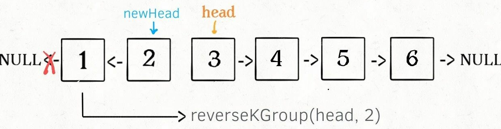

# 一、 链表的技巧

## 1 创建链表
### 1.1 创建正序链表--尾插
&emsp;（i）由于返回链表，需要有一个不动的头(dummy)记住链表
&emsp;（ii）尾插需要一个指针一直指向末尾，这里的p
&emsp;（iii）返回时需要delete之前的头，返回dummy->next，注意执行顺序

#### 1.1.1 参考代码
```C++
ListNode* creatList(std::vector<int> s){
    ListNode *dummy = new ListNode(0);           /**<要保证正序，需要一个head来记住，创建完成后直接返回head->next*/
    ListNode *p = dummy;

    /**<正序创建链表 */
    for (int i = 0; i < s.size(); ++i){
        ListNode *t = new ListNode(s[i]);
        p->next = t;
        p = t;                                  /**<尾插，保证指针一直指向末尾 */
    }
    p->next = NULL;

    ListNode* ans = dummy->next;                /**<注意delete和返回的顺序，因此有一个临时变量 */
    delete dummy;
    return ans;
}
```


### 1.2 创建反序链表--头插
&emsp;（i）反序链表其实也是链表的反转
&emsp;（ii）尾插需要一个指针一直指向开头，这里的newhead
&emsp;（iii）在操作之前，应当暂存p->next，结束的时候恢复出来，如temp

#### 1.2.1 参考代码
```C++
ListNode* reverseList(ListNode* head) {
    ListNode *newhead = NULL;

    for(ListNode *p = head; p != NULL; ) {
        ListNode *temp = p->next;           /**<这里要临时转存下p->next,最后又恢复给p  */

        p->next = newhead;
        newhead = p;                        /**<反序头永远要在开头哦 */

        p = temp;
    }
    return newhead;                         /**<反序头永远要在开头哦，所以直接返回即可 */
}
```
```java

```

## 2 快慢指针
### 2.1 寻找无环链表的中点
&emsp;（i）典型的快慢指针，一个快fast每次走两步，一个慢slow每次走一步
&emsp;（ii）当快fast指针到达终点的时候，慢指针刚好走到一半，<font color=#ff0000 size=4>奇数个元素，slow位于中间偏右！</font>
&emsp;（iii）循环条件<font color=#ff0000 size=5>fast != NULL && fast->next != NULL</font>

#### 2.1.1 参考代码
```C++
    /**<fast指针每次走两步，slow每次走一步 */
    ListNode *fast = head;
    ListNode *slow = head;
    while (fast != NULL && fast->next != NULL) {    /**<手动画下3，4个元素的情况*/
        fast = fast->next->next;
        slow = slow->next;
    }
```


### 2.2 寻找链表倒数第K个元素 19
&emsp;（i）典型的双指针，一个快fast先走k步，一个慢slow走
&emsp;（ii）若快指针达到链表尾，则直接返回slow

#### 2.2.1 参考代码
```C++
bool findLastNth(ListNode *head) {
    ListNode *fast = head;
    ListNode *slow = head;
    while(k-- > 0)
        fast = fast->next;

    while(fast != NULL){
        slow = slow->next;
        fast = fast->next;
    }
    return slow;
}
```


### 2.3 判断链表是否有环 141
&emsp;（i）典型的快慢指针，一个快fast每次走两步，一个慢slow每次走一步
&emsp;（ii）若有环，则快指针必多走一圈追上慢指针。也就是每隔(环内元素个数)追上一次
&emsp;（iii）证明线下

#### 2.3.1 参考代码
```C++
bool hasCycle(ListNode *head) {
    ListNode *fast = head;
    ListNode *slow = head;
    while (fast != NULL && fast->next != NULL) {        /**<手动画下元素只有3，4的情况*/
        fast = fast->next->next;
        slow = slow->next;
        if(fast == slow)                                /**<快慢指针走了之后才判断哈 */
            return true;
    }
    return false;
}
```


### 2.4 链表含有环，返回环的起点 142
&emsp;（i）典型的快慢指针，一个快fast每次走两步，一个慢slow每次走一步
&emsp;（ii）如上，让快指针追上慢指针
&emsp;（iii）之后将快指针指向开头，快慢指针行走速率都为1，相遇即环的起点位置

#### 2.4.1 参考代码
```C++
bool hasCycle(ListNode *head) {
    /**<STEP1 通过快慢指针找到第一次相遇位置 */
    ListNode *fast = head;
    ListNode *slow = head;
    while (fast != NULL && fast->next != NULL) {
        fast = fast->next->next;
        slow = slow->next;
        if(fast == slow)
            break;
    }

    /**<STEP2 将快指针移到开头，以相同的速率行走，相遇则返回 */
    fast = head;
    while (fast != slow) {
        fast = fast->next;
        slow = slow->next;
    }

    return fast;
}
```


## 3 递归思想
### 3.1 回文链表 234
&emsp;（i）最核心基础的数据类型是数组，链表。进而组成栈、队、堆、树、图等。从链表定义来看就注定它具有递归的特点，递归是浓墨重彩的一部分。
```C++
void traverse(ListNode *head){
    //前序遍历代码--正序
    traverse(head->next);
    //后序遍历代码--倒序
}
```
&emsp;（ii）递归的重点之一是递归的出口！
&emsp;（iii）回文需要正反两个方向遍历，进而判断是否相等。从左到右即myLeft，从右到左right
&emsp;（iv）选择后序遍历代码，也就是决定了从右到左的遍历方向，退栈的过程其实就是向左移动一个元素
#### 3.1.1 参考代码
```C++
ListNode *myLeft = NULL;                    /**<left和库名重复，所有取了新名字 */
bool traverse(ListNode *right){
    if(right == NULL)    return true;        /**<相当于初始条件，假定初始为真 */
    bool res = traverse(right->next);

    res = (res && right->val == myLeft->val);
    myLeft = myLeft->next;                  /**<右移动一个即可 */
    return res; 
}

bool isPalindrome(ListNode* head) {
    myLeft = head;                          /**<左边指针往右走 */
    return traverse(head);
}
```


### 3.2 反转链表 206
&emsp;（i）递归的重点之一是递归的出口，这里如果只有一个元素就不用反转**head->next == NULL**+只有一个元素的**head == NULL**
&emsp;（ii）开始，待反转链表

&emsp;（iii）**step 1**


&emsp;（iv）**step 2**

&emsp;（v）**step 3**

#### 3.2.1 参考代码
```C++
ListNode* reverseList(ListNode* head) {
    if(head == NULL || head->next == NULL)          /**<只有一个元素时直接返回本身即可，当元素中只有一个节点，此时head->next == NULL */
        return head;
    ListNode *last = reverseList(head->next);       /**< step 1 */
    head->next->next = head;                        /**< step 2 */
    head->next = NULL;                              /**< step 3 */
    return last;
}
```


### 3.3 反转链表前N个
&emsp;（i）在上面的代码中修改即可
&emsp;（ii）递归出口，只有一个元素不用反转，当然1都不用反转，0就更不用了
&emsp;（iii）每次要记住n+1结点--mySuccessor，事后恢复


#### 3.3.1 参考代码
```C++
ListNode *mySuccessor = NULL;
ListNode* reverseListN(ListNode* head, int n) {
    if(n == 1){                                 /**<只有一个元素时直接返回本身即可，这是需要记住它的next */
        mySuccessor = head->next;
        return head;
    }
    ListNode *last = reverseListN(head->next, n-1);
    head->next->next = head;
    head->next = mySuccessor;                     /**<将之前记住的恢复出来 */

    return last;
}
```

### 3.4 反转链表，区间[m,n] 92
&emsp;（i）在上面的代码中修改即可
&emsp;（ii）递归出口，m=1，即反转前N个元素reverseListN(head, n)
&emsp;（iii）递归不断前进到m、反序、再退回来

#### 3.4.1 参考代码
```C++
ListNode *successor = NULL;
ListNode* reverseBetween(ListNode* head, int m, int n) {
    if(m == 1)
        return reverseListN(head, n);                       /**<m=1,相当于反转前面N个*/
    
    /**<这里的head在不断靠近m位置，直到head->next是m，*/
    /**<这类一个很重要的问题？反转区间链表，其他区间不变，对吧？这里的递归就是不断前进到需要反序的区间进行反序，之后在原路返回 */
    /**<其实它什么都没干,只干了反序，也就是m==1 */
    head->next = reverseBetween(head->next, m - 1, n - 1);
    return head;
}
```

### 3.5 K个一组翻转链表 25
&emsp;（i）分成两个任务 = 反转[a,b) + 迭代找下一组
&emsp;（ii）反转就是常规链表迭代反序，只是终点是b
```C++
ListNode* reverse(ListNode* a, ListNode* b) {
    ListNode *newHead = NULL;

    for (ListNode *p = a; p != b; ) {
        ListNode *temp = p->next;           /**<这里要临时转存下p->next,最后又恢复给p  */

        p->next = newHead;
        newHead = p;                        /**<反序头永远要在开头哦 */

        p = temp;
    }

    return newHead;
}
```

&emsp;（iii）迭代找下一组，也就是确定下一组a,b的值
&emsp;（iv）链表不空是无法确定剩下的是否不够K个



#### 3.5.1 参考代码
```C++
ListNode* reverseKGroup(ListNode* head, int k) {
    if(head == NULL)    return head;
    /**<注意区间[a,b)中有k个元素,其实b已经是k+1个元素了 */
    ListNode *a = head;
    ListNode *b = head;
    for (int i = 0; i < k; ++i) {
        if(b == NULL)   return head;
        b = b->next;
    }

    /**<STEP1 反转k个元素 */
    ListNode *newHead = reverse(a, b);
    /**<STEP2 反转下一组k个元素并连接 */
    a->next = reverseKGroup(b, k);

    return newHead;
}
```

